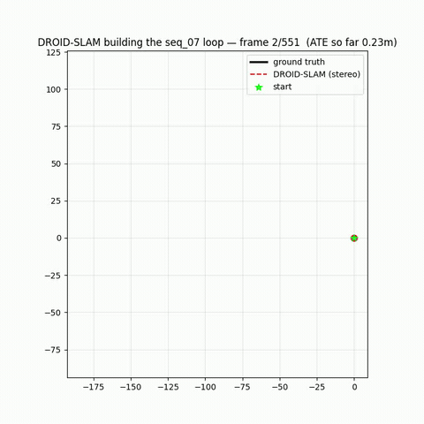
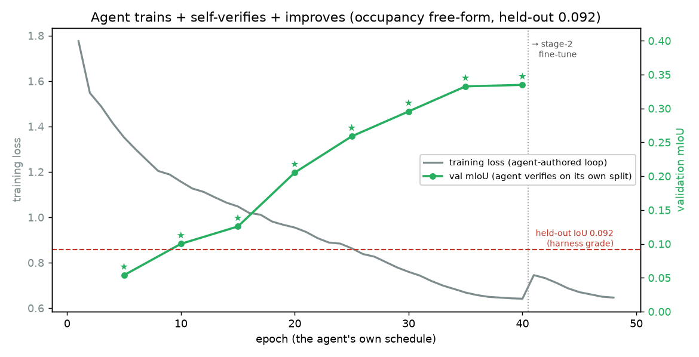
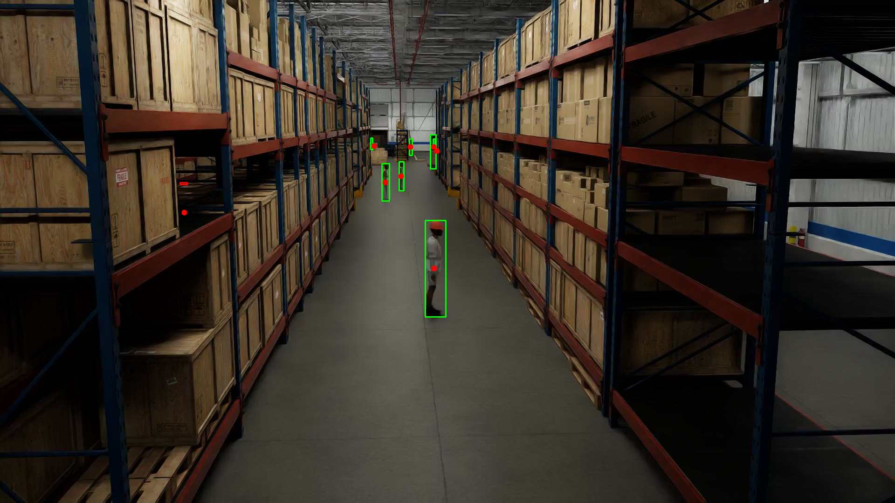

# LenaLab — Visual Gallery

A picture tour of the project: what the agent built, trained, and got graded on — across seven domains.
Every result shown is measured on **held-out data the agent never saw**.

> ▶️ **Animations embedded below are GIFs — they play automatically on GitHub** (and in any markdown
> viewer that renders GIFs). HD `.mp4` versions sit beside them in the same folder for higher quality.

---

## 🛰️ SLAM & visual odometry (autonomous driving)

### Feature tracking on real driving video ▶️ *(animated)*

The agent's VO tracking hundreds of features (colored flow trails) across a KITTI street sequence — the
front-end that estimates camera motion. *(Still strip: `artifacts/slam_benchmark/tracking_seq07_strip.png`;
HD video: `tracking_seq07.mp4`.)*

### Dense SLAM map of a km-scale loop ▶️ *(animated build)*

Stereo DROID-SLAM reconstructing a full KITTI loop — the static map (top-down height-colored + 3D),
and the loop **assembling frame by frame** below. The trajectory (red) closes the loop;
**0.03–0.20 % error on km-scale loops.** *(More: `droid_stereo_seq{05,07,09}.png`, `leaderboard_seq07.png`.)*

### Trajectory demos (TUM indoor) ▶️ *(animated)*

The agent's estimated camera path animated against ground truth — monocular (top) and RGB-D (bottom).
*(Final overlays: `artifacts/demo/trajectory.png`, `artifacts/demo_rgbd/trajectory.png`.)*

---

## 🚗 BEV perception (multi-camera → top-down vehicle occupancy)

### Before / after: reference vs the agent's network

Left: the 6 surround cameras. Right: top-down vehicle occupancy — **BEFORE** (from-scratch reference)
vs **AFTER** (agent's network), against the held-out ground truth. Green = correct, red = missed,
blue = false. The agent roughly doubles IoU (e.g. 0.07 → 0.15) on scenes it never saw.

▶️ *Animated sweep across a held-out scene:*

### The variance finding (the headline science)
`artifacts/bev/bev_variance_n3.png` and `artifacts/bev/bev_scaffold_compare.png` — free-form agent runs
scatter (high variance); locking the geometry in a **scaffold** collapses the variance ~7× to
**0.136 ± 0.005 IoU, 3/3 passing**. The same effect replicates in 3D (`artifacts/occ/occ_scaffold_compare.png`).

---

## 🧊 3D occupancy (cameras → voxel grid)

### Predicted occupancy vs ground truth

Left: surround cameras. Right: held-out 3D vehicle occupancy — **GT vs the agent's prediction**
(height-colored, plus a TP/FN/FP overlay). The camera→voxel mapping the agent authored genuinely
localizes vehicles in 3D.

### The agent training itself

The agent's *own* training run: loss falling as its validation mIoU climbs (★ = each new best it kept),
then a fine-tune stage. This is the agent **improving a network by training it**, in one session.

---

## 🏭 Smart-space floor occupancy (the 7th domain — off the road)

### Warehouse demo — camera → live floor map ▶️ *(animated)*

A static warehouse camera with **agent detections** drawn (green boxes, left) beside the **live top-down
floor-occupancy map** (right, agents as bright dots) — swept across the held-out (unseen-time) window.
This is the domain's job: turn fixed cameras into a moving "what's where" map of the space.

### "A map, not a camera"

Three of the 19 fixed warehouse cameras (left) → a **top-down floor-occupancy map** (right): the dots are
agents (people/forklifts/robots) on the floor. This is the privacy-preserving "map, not a camera" output
the agent learns — and **beat the hand-written reference ~2× (0.39–0.44 held-out IoU)** by inventing
temporal background subtraction from noticing the cameras are static.

### How we de-risked it

Phase-0 check: the dataset's 3D-box ground truth (green) projected through the calibration onto a real
camera frame, landing on the actual people/objects — confirming the geometry before building the domain.

---

## 🔬 Method & data

- **Pipeline overview:** `artifacts/blog/ep0_pipeline.png` — the solver-vs-verifier architecture.
- **Autonomous committee:** `artifacts/blog/ep7_committee.png` — a multi-expert agent program improving
  held-out ATE 26 % over a lineage of experiments.
- **Learned VO:** `artifacts/blog/ep8_learned.png` — the agent's from-scratch GPU pose-CNN.
- **Sim-to-real fidelity ladder:** `artifacts/blog/fidelity_ladder.png`, `sim2real_closure.png`.
- **Capability-not-memorization:** `artifacts/blog/contamination_synthetic.png` — the agent beats the
  reference on a provably-unseen synthetic world (nothing to memorize).
- **Data galleries:** `artifacts/blog/data_gallery.png`, `synth_sample.png`.

---

## Where to go next
- **The numbers behind every picture:** [`RESULTS.md`](RESULTS.md)
- **What the agent figured out (design decisions):** [`claudedocs/what_the_agent_figured_out.md`](claudedocs/what_the_agent_figured_out.md)
- **The full story:** [`claudedocs/project_report_2026-06-21.md`](claudedocs/project_report_2026-06-21.md)
- **The chronicle (episode by episode):** [`claudedocs/blog_agent_in_a_lab_2026-06-03.md`](claudedocs/blog_agent_in_a_lab_2026-06-03.md)
