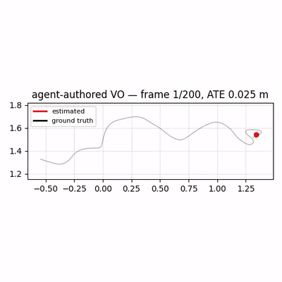
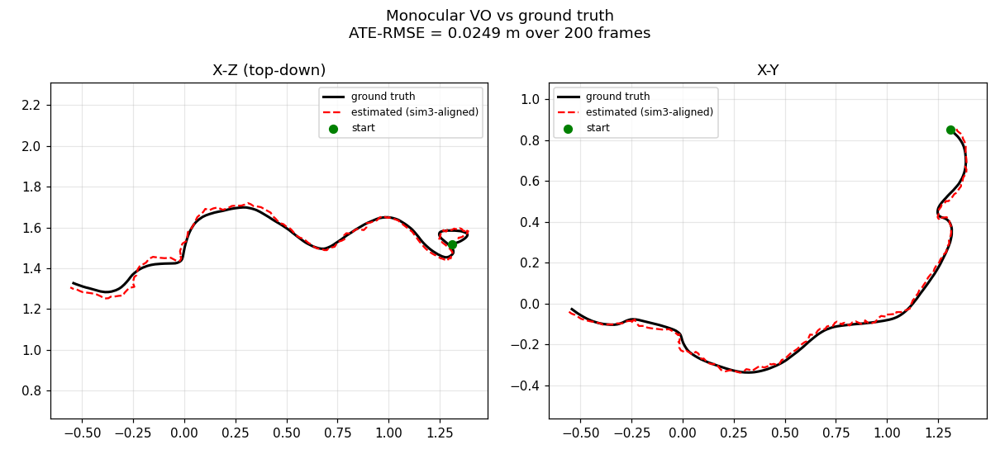

# LenaLab — a computer-vision research lab where agents implement, and an independent verifier judges

*(Named for Lena/Lenna, the canonical computer-vision test image.)*

LenaLab is the **solver / research-team** half of a generator⟂verifier split. LLM "expert"
agents are given a well-specified vision problem and produce a solution — by **authoring
algorithm code from scratch** (Track B) or **tuning a vetted recipe** (Track A) — and a
result counts as "done" only when an **independent** evaluator measures it on a **held-out**
split the solver never saw and cannot game, against a fixed oracle.

It does **not** reimplement a verifier: it imports **Touchstone** (the verification spine)
and adds the vision domain. The harness is domain-agnostic (a domain is a plugin behind
`{dataset, oracle/metric, held-out}`), and it now spans **six agent-authored domains** —
from ego-motion (VO/SLAM) to multi-camera **perception** (BEV) and **3D occupancy** — proving the
verification discipline generalizes across problem classes, not just one task. The Python package is `vo_lab`.

### Six domains, one discipline (agent implements · independent verifier judges · held-out data)

| Domain | What the agent authored | Held-out result | Verdict |
|---|---|---|---|
| **RGB-D VO** | SIFT→PnP RANSAC + KLT, metric depth | **ATE 0.033 m** (SE3, unseen scene) — beats classical 0.057 | ✅ VERIFIED |
| **Monocular VO** | optical-flow + wide-baseline keyframes | ATE 0.052 m (Sim3, unseen) | ✅ VERIFIED |
| **KITTI stereo VO** | SGBM depth → ORB → PnP, outdoor driving | t_err 2.08% (unseen seq 05/07) | ✅ VERIFIED |
| **Learned VO** (GPU) | ResNet pose-CNN + optical-flow input, trained from scratch | 18.5 ± 0.7 m (n=3) — beats learned ref ~1.7× | ✅ VERIFIED |
| **BEV perception** | Lift-Splat, 6 surround cams → top-down vehicle occupancy | scaffolded **0.136 ± 0.005 IoU, 3/3** (free-form 2/3) | ✅ VERIFIED + variance-fixed |
| **3D occupancy** | Lift-Splat-to-3D, 6 cams → 200×200×12 voxel grid | scaffolded **0.079 ± 0.004 IoU, 3/3** (free-form 2/3) | ✅ VERIFIED + variance-fixed |

Plus a real **SLAM benchmark** (stereo DROID, **0.03–0.20 %** on km-scale KITTI loops) and honest
negatives kept on the record (from-scratch loop closure, C++ IMU fusion). **[Full evidence → `RESULTS.md`](RESULTS.md).**

> ### 🔬 The headline finding (replicated in 2D *and* 3D)
> When an agent authors a perception net **freely**, its results are **high-variance** — it can
> author a great network *or* self-sabotage the fragile geometry/augmentation (BEV & occupancy
> free-form: ~2/3 pass, σ≈0.02–0.03). **Lock the fragile parts in a scaffold and let it author only
> the network, and the variance collapses ~6–7× to near-reference reliability (3/3 pass).** So an
> agent's *authoring freedom is its variance source, and scaffolding scopes it* — demonstrated with
> clean **n=3** comparisons in both 2D (BEV) and 3D (occupancy). The full arc — build → find it's
> non-robust → diagnose → fix → validate → **replicate** — is the lab working as a *method*, not a demo.

> ## 📊 **[Results & Highlights → `RESULTS.md`](RESULTS.md)**
> Real km-scale SLAM (stereo DROID **0.06–0.20%** on KITTI loops, visualized), agent-authored
> **multi-camera BEV + 3D occupancy** perception (nuScenes), the **scaffold variance-collapse finding
> replicated in 2D and 3D**, the variance-audited sim-to-real fidelity ladder, and a **trustworthiness
> audit** that retracted one flagship and verified the rest. **Start there for the evidence.**

**How it works (architecture + diagrams + where the AI is involved):** [`docs/HOW_IT_WORKS.md`](docs/HOW_IT_WORKS.md).
See `claudedocs/` for the research report, architecture design, and the trial write-up.

## Demo — a Claude agent wrote this VO; the verifier judged it on real footage

<p align="center">
  <br>
  <em>Agent-authored RGB-D VO on an <strong>unseen</strong> sequence (TUM fr1/desk): estimated path (red) vs ground truth (black).</em>
</p>



A sandboxed Claude agent authored an **RGB-D visual-odometry algorithm from scratch** (SIFT →
3D-2D PnP RANSAC, KLT optical-flow fallback, keyframe recovery; depth for metric scale). The
independent verifier ran it on a **held-out sequence it never saw** (`fr1/desk`, a different
scene than the dev `fr1/xyz`), scored with **SE(3) metric** alignment (no scale freebie), and
measured **ATE-RMSE = 0.033 m** (RPE 0.010, scale-error 0.03 — i.e. near-perfect absolute
scale). It cleared the 0.086 m bar and beat the classical RGB-D reference (0.057 m). The agent
never saw the ground truth and could not edit the grader.

Algorithm: [`artifacts/agent_authored_vo_rgbd_v1.py`](artifacts/agent_authored_vo_rgbd_v1.py) ·
video: [`artifacts/demo_rgbd/vo_demo.mp4`](artifacts/demo_rgbd/vo_demo.mp4) ·
write-up: [`claudedocs/trial_track_b_tum_2026-06-02.md`](claudedocs/trial_track_b_tum_2026-06-02.md).

<details><summary>Earlier monocular result (same lab, harder-to-trust metric)</summary>

The first domain was monocular VO: an agent-authored algorithm scored **ATE 0.052 m**
(Sim(3)-aligned, scale-corrected) on held-out `fr1/xyz`. Demo:
[`artifacts/demo/`](artifacts/demo) · algorithm:
[`artifacts/agent_authored_vo_tum_v2.py`](artifacts/agent_authored_vo_tum_v2.py). The RGB-D
result above is stronger: it's **metric** (no scale gift) and on an **unseen** scene.
</details>

## Run it (10 seconds, offline — no Docker, GPU, or API key)

```bash
pip install -r requirements.txt          # numpy, opencv-python, pytest
# keep blueberry_ver2 as a sibling dir, or: export VER2_PATH=/path/to/blueberry_ver2
PYTHONPATH=. python -m vo_lab.selftest    # or: python -m vo_lab.run_vo_calibration
PYTHONPATH=. python -m pytest tests/ -q
```

Expected — the **reproduction-first calibration gate**:

```
positive (honest ORB-VO):  status=VERIFIED  ate_rmse=0.079   (<= 0.40 bar)
negative (static control): status=REJECTED  ate_rmse=3.52    (grader is no rubber stamp)
CALIBRATION GATE: OPEN (autonomy unlocked)
tokens spent: 0 | io wall seconds (uncharged): ~2s
```

## What this proves (the failures it prevents)

- **"It runs" ≠ success.** Success = held-out ATE-RMSE under a fixed bar, measured by an
  independent evaluator — not the solver's self-report.
- **Monocular scale gaming.** ATE is computed after **Sim(3) Umeyama alignment**, fixed in
  the harness-owned `eval.py`; the solver cannot choose its own alignment.
- **Data gaming.** The synthetic world's seed and the held-out ground truth are
  harness-owned; the solver only ever receives rendered frames.
- **Turn waste.** Generation/evaluation run as harness **jobs** (IO uncharged); budget is
  tokens+experiments, never "turns".

## Track A — the expert committee (autonomous lineage)

The "research-team meeting": a PI + Geometry/SLAM + Data committee proposes
**menu-constrained** experiments (it can only select + clamp a vetted recipe's params,
never invent a command), each **independently verified on the held-out split**, building on
a memory of prior runs — all gated behind reproduction-first calibration.

```bash
# offline (no API key): proves the full loop machinery with a fake committee
PYTHONPATH=. python -m pytest tests/test_vo_committee.py -q
# live (billed): real Claude committee sessions
ANTHROPIC_API_KEY=... python -m vo_lab.run_vo_committee
```

Honest scope: on the easy synthetic world ORB params barely move the metric, so Track A
demonstrates the loop **machinery + safety properties**, not an improvement curve. Genuine
algorithm authoring is **Track B**.

## Track B — the Implementer (the solver authors the algorithm)

The solver **writes a VO algorithm** (`main.py`) and is graded on the held-out split by the
harness-owned grader it can't touch. This is where "experts implement algorithms" stops
being parameter-tuning. The agent authors only the implementation; the harness owns the
grader (`eval.py`) and the oracle (`ATE-RMSE <= bar`), so the solver can't grade or game
itself.

```bash
# offline (no API/Docker): proves the verification + anti-tamper property with a fake author
PYTHONPATH=. python -m pytest tests/test_vo_implementer.py -q
# live (billed + Docker): a sandboxed Claude session writes & debugs main.py
ANTHROPIC_API_KEY=... python -m vo_lab.run_vo_implement
```

The decisive offline test (`test_grader_tamper_is_blocked`): the fake author writes
degenerate code **and** a malicious `eval.py` claiming `ate_rmse=0.0` — the evaluator
re-instantiates the harness-owned grader before judging, the true (large) error stands, and
the run is **REJECTED**. The tamper earns nothing.

## Layout

```
vo_lab/
  factory.py            build_vo_harness / build_vo_committee_harness / build_vo_implementer_harness
  agents/vo_committee.py   VO expert panel (PI + Geometry/SLAM + Data) over ver2's Committee  [Track A]
  agents/vo_implementer.py VO implementation task + reference author over ver2's Implementer  [Track B]
  plugins/vo.py         VODatasetProvider (synthetic) · VOMetricExtractor · vo_recipe · calibration
  plugins/vo_ref/
    run.py              classical ORB monocular VO (params: nfeatures, ransac_thresh; + degenerate control)
    eval.py        *    HARNESS-OWNED grader: Sim(3) ATE-RMSE + vo_score on held-out GT
  selftest.py · run_vo_calibration.py · run_vo_committee.py · run_vo_implement.py
images/registry.yaml    CUDA image matrix (empty for the CPU MVP; cpu-opencv + learned-VO upgrade paths)
tests/                  7 tests, all CPU/offline: calibration gate, committee lineage, implementer + grader-tamper
```

## Real data (TUM RGB-D)

KITTI's odometry images are a single ~22 GB download (no per-sequence option), so the
minimal real benchmark is **TUM RGB-D** (`freiburg1_xyz`, ~0.5 GB, ground-truth trajectory).
The provider downloads once (shared `~/.cache/vo_lab/tum`), pre-associates GT to frames by
timestamp, and emits the same on-disk contract — so the grader is unchanged.

```bash
# local, non-billed: download once + measure the reference baseline + open the gate on REAL data
PYTHONPATH=. python -m vo_lab.run_vo_tum_calibration
# -> prints the held-out bar; then run live Track B on real data (billed + Docker):
ANTHROPIC_API_KEY=... python -m vo_lab.run_vo_tum_implement <bar>
```

Measured on TUM fr1/xyz (first 200 frames): reference monocular ORB-VO held-out
**ATE-RMSE = 0.089 m** (Sim(3)-aligned), degenerate control rejected at 0.165 m → gate OPEN.
The Track-B bar is "match or beat the classical baseline" (baseline-beating oracle).

### Trial: a live agent wrote VO that works on real footage
A sandboxed Claude agent authored a 360-line PnP-centric monocular VO; graded on real
held-out data it **VERIFIED at ATE 0.124 m** (≤ 0.134 m bar). Full write-up + demo:
- Report: `claudedocs/trial_track_b_tum_2026-06-02.md`
- Trajectory plot: `artifacts/demo/trajectory.png` · Demo video: `artifacts/demo/vo_demo.mp4`
- The algorithm it wrote: `artifacts/agent_authored_vo_tum_v1.py`
- Regenerate the demo (no API): `python -m vo_lab.visualize <main.py> <frames> <gt.txt> <out>`

## Status & roadmap

The harness spine (offline calibration gate, Track A committee, Track B implementer, anti-tamper
grading) is built and proven, and **six agent-authored domains are VERIFIED** on real held-out
data (table above; full evidence in [`RESULTS.md`](RESULTS.md)):

- **Localization** — monocular VO, RGB-D VO (metric, 0.033 m), KITTI stereo VO (outdoor driving),
  learned VO on GPU (n=3 variance-audited), and a real **SLAM benchmark** (stereo DROID on
  km-scale KITTI loops, 0.03–0.20 %).
- **Perception** — multi-camera **BEV** vehicle occupancy and **3D occupancy** (nuScenes), both
  with the scaffold variance-collapse finding (n=3). Reports:
  [`bev_track_b_report`](claudedocs/bev_track_b_report_2026-06-15.md) ·
  [`occ_domain_report`](claudedocs/occ_domain_report_2026-06-19.md).
- **Discipline** — a **trustworthiness audit** that retracted one over-claimed result and
  variance-bounded the rest; honest negatives (from-scratch loop closure, C++ IMU fusion) kept on
  the record; a real harness gap (no job-level timeout → a 3 h hang) surfaced and fixed.

**Open frontiers:** scaling a perception domain to full nuScenes / more classes on a Docker-capable
cloud GPU (for a competitive, non-mini number); multi-lab peer review via Touchstone's `exchange`.
The design notes live in `claudedocs/`.
