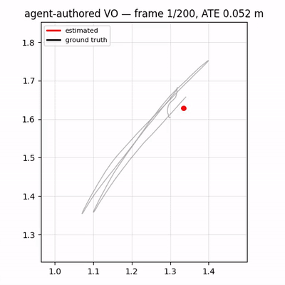

# LenaLab — a computer-vision research lab where agents implement, and an independent verifier judges

*(Named for Lena/Lenna, the canonical computer-vision test image.)*

LenaLab is the **solver / research-team** half of a generator⟂verifier split. LLM "expert"
agents are given a well-specified vision problem and produce a solution — by **authoring
algorithm code from scratch** (Track B) or **tuning a vetted recipe** (Track A) — and a
result counts as "done" only when an **independent** evaluator measures it on a **held-out**
split the solver never saw and cannot game, against a fixed oracle.

It does **not** reimplement a verifier: it imports **Touchstone** (the verification spine)
and adds the vision domain. The harness is domain-agnostic (a domain is a plugin behind
`{dataset, oracle/metric, held-out}`); the first and current domain is **Visual Odometry**.
The Python package is `vo_lab`.

See `claudedocs/` for the research report, architecture design, and the trial write-up.

## Demo — a Claude agent wrote this VO; the verifier judged it on real footage

<p align="center">
  <br>
  <em>Estimated camera path (red, Sim(3)-aligned) vs ground truth (black), traced over 200 real frames.</em>
</p>


A sandboxed Claude agent authored a monocular visual-odometry algorithm **from scratch**
(`goodFeaturesToTrack` + optical-flow tracking with a wider keyframe baseline, SIFT fallback,
keyframe interpolation). An independent verifier ran it on a **held-out** real trajectory it
never saw and measured **ATE-RMSE = 0.052 m** (≤ the 0.134 m bar — and better than the classical
ORB-VO reference baseline of 0.089 m). The agent never saw the ground truth and could not edit
the grader.

Full-resolution video (camera feed + trajectory): [`artifacts/demo/vo_demo.mp4`](artifacts/demo/vo_demo.mp4) ·
the algorithm it wrote: [`artifacts/agent_authored_vo_tum_v2.py`](artifacts/agent_authored_vo_tum_v2.py) ·
write-up: [`claudedocs/trial_track_b_tum_2026-06-02.md`](claudedocs/trial_track_b_tum_2026-06-02.md).

## Run it (10 seconds, offline — no Docker, GPU, or API key)

```bash
pip install -r requirements.txt          # numpy, opencv-python, pytest
# keep blueberry_ver2 as a sibling dir, or: export VER2_PATH=/path/to/blueberry_ver2
PYTHONPATH=. python -m vo_lab.selftest    # or: python -m vo_lab.run_vo_calibration
PYTHONPATH=. python -m pytest tests/ -q
```

Expected — the **reproduction-first calibration gate**:

```
positive (honest ORB-VO):  status=VERIFIED  ate_rmse=0.079   (<= 0.40 bar)
negative (static control): status=REJECTED  ate_rmse=3.52    (grader is no rubber stamp)
CALIBRATION GATE: OPEN (autonomy unlocked)
tokens spent: 0 | io wall seconds (uncharged): ~2s
```

## What this proves (the failures it prevents)

- **"It runs" ≠ success.** Success = held-out ATE-RMSE under a fixed bar, measured by an
  independent evaluator — not the solver's self-report.
- **Monocular scale gaming.** ATE is computed after **Sim(3) Umeyama alignment**, fixed in
  the harness-owned `eval.py`; the solver cannot choose its own alignment.
- **Data gaming.** The synthetic world's seed and the held-out ground truth are
  harness-owned; the solver only ever receives rendered frames.
- **Turn waste.** Generation/evaluation run as harness **jobs** (IO uncharged); budget is
  tokens+experiments, never "turns".

## Track A — the expert committee (autonomous lineage)

The "research-team meeting": a PI + Geometry/SLAM + Data committee proposes
**menu-constrained** experiments (it can only select + clamp a vetted recipe's params,
never invent a command), each **independently verified on the held-out split**, building on
a memory of prior runs — all gated behind reproduction-first calibration.

```bash
# offline (no API key): proves the full loop machinery with a fake committee
PYTHONPATH=. python -m pytest tests/test_vo_committee.py -q
# live (billed): real Claude committee sessions
ANTHROPIC_API_KEY=... python -m vo_lab.run_vo_committee
```

Honest scope: on the easy synthetic world ORB params barely move the metric, so Track A
demonstrates the loop **machinery + safety properties**, not an improvement curve. Genuine
algorithm authoring is **Track B**.

## Track B — the Implementer (the solver authors the algorithm)

The solver **writes a VO algorithm** (`main.py`) and is graded on the held-out split by the
harness-owned grader it can't touch. This is where "experts implement algorithms" stops
being parameter-tuning. The agent authors only the implementation; the harness owns the
grader (`eval.py`) and the oracle (`ATE-RMSE <= bar`), so the solver can't grade or game
itself.

```bash
# offline (no API/Docker): proves the verification + anti-tamper property with a fake author
PYTHONPATH=. python -m pytest tests/test_vo_implementer.py -q
# live (billed + Docker): a sandboxed Claude session writes & debugs main.py
ANTHROPIC_API_KEY=... python -m vo_lab.run_vo_implement
```

The decisive offline test (`test_grader_tamper_is_blocked`): the fake author writes
degenerate code **and** a malicious `eval.py` claiming `ate_rmse=0.0` — the evaluator
re-instantiates the harness-owned grader before judging, the true (large) error stands, and
the run is **REJECTED**. The tamper earns nothing.

## Layout

```
vo_lab/
  factory.py            build_vo_harness / build_vo_committee_harness / build_vo_implementer_harness
  agents/vo_committee.py   VO expert panel (PI + Geometry/SLAM + Data) over ver2's Committee  [Track A]
  agents/vo_implementer.py VO implementation task + reference author over ver2's Implementer  [Track B]
  plugins/vo.py         VODatasetProvider (synthetic) · VOMetricExtractor · vo_recipe · calibration
  plugins/vo_ref/
    run.py              classical ORB monocular VO (params: nfeatures, ransac_thresh; + degenerate control)
    eval.py        *    HARNESS-OWNED grader: Sim(3) ATE-RMSE + vo_score on held-out GT
  selftest.py · run_vo_calibration.py · run_vo_committee.py · run_vo_implement.py
images/registry.yaml    CUDA image matrix (empty for the CPU MVP; cpu-opencv + learned-VO upgrade paths)
tests/                  7 tests, all CPU/offline: calibration gate, committee lineage, implementer + grader-tamper
```

## Real data (TUM RGB-D)

KITTI's odometry images are a single ~22 GB download (no per-sequence option), so the
minimal real benchmark is **TUM RGB-D** (`freiburg1_xyz`, ~0.5 GB, ground-truth trajectory).
The provider downloads once (shared `~/.cache/vo_lab/tum`), pre-associates GT to frames by
timestamp, and emits the same on-disk contract — so the grader is unchanged.

```bash
# local, non-billed: download once + measure the reference baseline + open the gate on REAL data
PYTHONPATH=. python -m vo_lab.run_vo_tum_calibration
# -> prints the held-out bar; then run live Track B on real data (billed + Docker):
ANTHROPIC_API_KEY=... python -m vo_lab.run_vo_tum_implement <bar>
```

Measured on TUM fr1/xyz (first 200 frames): reference monocular ORB-VO held-out
**ATE-RMSE = 0.089 m** (Sim(3)-aligned), degenerate control rejected at 0.165 m → gate OPEN.
The Track-B bar is "match or beat the classical baseline" (baseline-beating oracle).

### Trial: a live agent wrote VO that works on real footage
A sandboxed Claude agent authored a 360-line PnP-centric monocular VO; graded on real
held-out data it **VERIFIED at ATE 0.124 m** (≤ 0.134 m bar). Full write-up + demo:
- Report: `claudedocs/trial_track_b_tum_2026-06-02.md`
- Trajectory plot: `artifacts/demo/trajectory.png` · Demo video: `artifacts/demo/vo_demo.mp4`
- The algorithm it wrote: `artifacts/agent_authored_vo_tum_v1.py`
- Regenerate the demo (no API): `python -m vo_lab.visualize <main.py> <frames> <gt.txt> <out>`

## Status & roadmap

- **Done (increment 1):** offline spine + classical OpenCV VO + Sim(3) ATE grader +
  reproduction-first calibration gate (local mode).
- **Done (increment 2):** Track A expert committee + autonomous lineage.
- **Done (increment 3):** Track B Implementer — sandboxed VO authoring; live run wrote its
  own VO and VERIFIED at ATE 0.049 on synthetic, beating the reference baseline.
- **Done (increment 4):** real-data provider (TUM RGB-D); calibration ran on real frames,
  reference ATE 0.089 m, gate OPEN.
- **Next:** live Track B on real data (`run_vo_tum_implement`); learned VO (DPVO) on the
  RTX 3080 via a prebuilt CUDA image; multi-lab peer review via ver2's `exchange`.
  See `claudedocs/design_ver3_harness_architecture_2026-06-02.md` §9.
