# An Agent in a Lab: A Chronicle of LenaLab

*How a verification-first harness let an AI agent author computer-vision algorithms from
scratch — and what it got right, wrong, and never quite figured out.*

— Written 2026-06-03, covering work done 2026-06-02.

---

## The premise

LenaLab is built on one idea borrowed from Anthropic's **harness-engineering** work: never
let the agent that *produces* a result be the one that *decides* whether it's any good.

So the lab has two halves that don't trust each other. A **solver** — a Claude agent — writes
a visual-odometry algorithm from scratch in a sealed sandbox. A **verifier** — pure,
deterministic Python with no model anywhere in it — runs that code on a *held-out* trajectory
the agent never saw and measures the error with closed-form geometry. "It ran" is never
success. The only thing that earns a ✅ is a held-out number under a bar that was fixed
*before* the agent started.

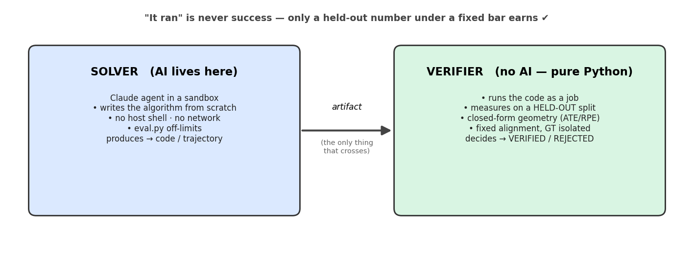

Everything below is what happened when we actually ran it. Each episode follows the same
shape: **what got built → how it improved on the last one → what broke → the lesson.** The
numbers are pulled straight from the run registries, not rounded for flattery.

---

## Episode 0 — Building the bench (13:08)

*Commit `74377be` — "verification-first computer-vision research lab"*

Before the agent could do anything, the lab itself had to exist. The key decision was **not to
build a verifier** — the whole verification spine (the state-machine loop, the held-out
evaluator, the crash-resumable registry, the token+experiment budget, the single-GPU lease,
the Docker job-runner) was *imported* from a prior project, "Touchstone." LenaLab added only
the vision domain: the dataset provider, a classical reference algorithm, the grader, and the
expert prompts.

The discipline that made the rest possible was the **calibration gate**: before the agent is
allowed a single autonomous turn, the verifier must VERIFY a known-good run *and* REJECT a
deliberately broken one. If it can't tell those apart, it's a rubber stamp, and the lab refuses
to open.

**What could be better, even here:** the gate proves the grader isn't *blind*, but it can't
prove the held-out split isn't *correlated* with the training split. That limitation never
went away — it's honestly noted in the design doc and it's still true.

---

## Interlude — what the data looks like, and when an error is "good enough"

Before the episodes, two things that make the numbers below readable: *what the agent was looking at*,
and *what a given drift actually means in the field*. The agent worked across three very different
worlds:

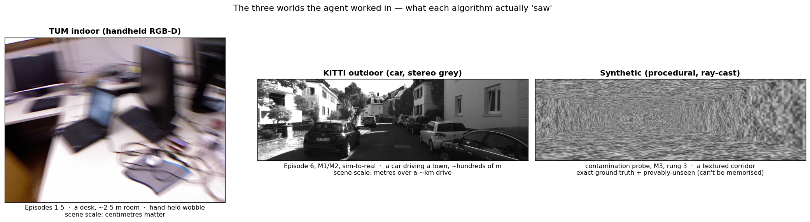

A drift number is meaningless without the scene's scale — "3.5 m of error" is excellent for a car
that drove a kilometre and a disaster for a desk. So here is every headline result translated into
plain terms, with an honest read on whether it would survive in the field:

| Episode(s) | World | Result | In plain terms | Field-usable? |
|---|---|---|---|---|
| 1–2 · Mono VO | TUM desk | 0.052–0.124 m (Sim3, **shape-only**) | follows the path's *shape*, but has **no real-world scale** (~40× off) | ❌ not for absolute position — a single camera *cannot* recover scale alone |
| 3 · RGB-D VO | TUM desk | **0.033 m** (unseen) | ~3 cm drift across a desk-scale room | ✅ genuinely good for **indoor AR / robotics** (cm-level), because depth restores metric scale |
| 5 · SLAM | TUM room | 0.185 m (**in-sample**) | ~18 cm, but tuned *and* tested on the same room | ⚠️ promising, but not a clean generalization number |
| 6 · KITTI VO | driving | 3.53 m (unseen) | car ends ~3.5 m off after a sub-km drive (~0.5%) | ⚠️ typical *pure-VO* drift — fine as a **front-end**, but needs loop-closure/GPS for long range |
| 9 · Bundle adj. (M1) | KITTI | **2.03%** of distance | basic VO is 2.81%, pro ORB-SLAM2 is 1.15% | ⚠️ research-competitive front-end, still **below deployed SOTA** |
| 10 · Loop closure (M2) | KITTI | 6.53% (worse than basic) | the agent's global SLAM diverged every way we tried | ❌ the agent's wall — *not* shippable |
| 15 · VIO (M3) | synthetic | **3.83%** (vs VO-alone **18%**) | bridges camera blackouts where vision-only loses the path | ✅ the **deployable direction** — exactly what real systems (VINS-Fusion) do |
| 16 · Learned VO | synthetic → real | **0.45 m** → **27–70 m** | superb in simulation, **collapses on real photos** | ❌ on real driving — a sim-trained network isn't deployable |

The short version of the whole chronicle, in field terms: **the agent ships a solid indoor RGB-D
front-end (cm-level) and the right deployable *idea* (sensor fusion / VIO); it does not ship
loop-closure SLAM, and its learned VO is a lab capability, not a road-ready system.**

---

## Episode 1 — First light, and the cost of perfectionism (≈03:17–03:44, salvaged)

*Algorithm archived: `agent_authored_vo_tum_v1.py`*

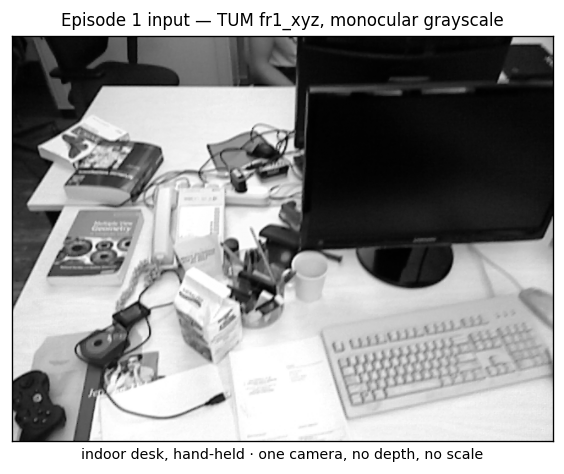

The first real trial: a sandboxed agent was asked to write **monocular visual odometry** for
the TUM `fr1_xyz` sequence — recover the camera's path from a stream of plain grayscale frames,
graded against a motion-capture ground truth it couldn't see. The bar was set by running a
classical ORB reference (**0.089 m**) and allowing ×1.5 → **0.134 m**.

The agent wrote 360 lines on its own. It chose a genuinely sophisticated design: **PnP-centric
pose estimation against a maintained 3-D landmark map, with deferred initialization** — it
*waited* until the camera baseline was wide enough for a reliable two-view triangulation, then
back-filled the earlier frames. Reprojection-pruned map, optical-flow tracking, graceful
pose-holding when a frame failed.

**The result, when finally graded: VERIFIED at 0.124 m.** It cleared the bar — though, tellingly,
it was *worse than the simple classical reference* (0.124 vs 0.089). Good monocular tracking
early, then the classic end-of-sequence drift.

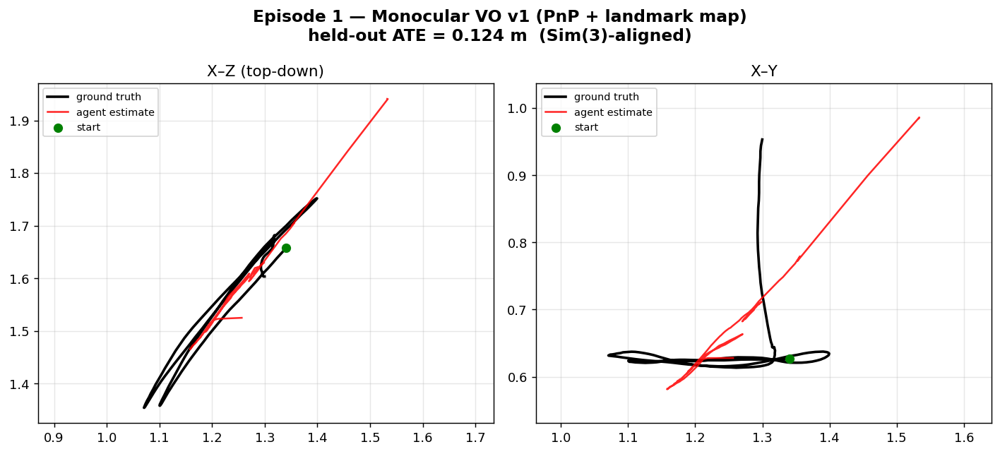

*Red is the agent's path, black is ground truth. It hugs the truth through the middle of the
run, then the X–Y panel shows it failing to capture the lateral back-and-forth and drifting off
— exactly the monocular weakness the next episode set out to fix.*

### The first failure

The live run printed `RESULT: FAILED` — and it was neither a hang nor a bad algorithm. The agent
kept *refining* to chase the tight bar and hit its **40-turn authoring limit**. The SDK raised,
and the harness threw away 27 minutes of *working code* as a failure.

> **Lesson 1 — a budget limit must never discard a valid artifact.**
> We shipped `resilient_sdk_author`: if a session ends early but left a runnable entry file, the
> evaluator grades it anyway. A turn cap is a *spending* limit, not a verdict. This single fix is
> what made every later run survivable.

---

## Episode 2 — The clean re-run, and beating the reference (13:37)

*Commit `dcb3057` · algorithm: `agent_authored_vo_tum_v2.py`*

With the resilient author in place and the budget raised to 80 turns, we re-ran the *same task*.
This time the agent took a different and better tack: **`goodFeaturesToTrack` + optical-flow
tracking, a wider keyframe baseline (skip every other frame), a SIFT fallback, and keyframe
interpolation.**

**Result: VERIFIED automatically at 0.052 m** — no manual salvage, and this time below the
classical reference's number (0.052 vs 0.089). A background watchdog guarded the unattended run
and fired zero kills.

> **⚠️ Correction (2026-06-04).** This is **monocular Sim(3)** — scale is unobservable, so the
> grader rescales the trajectory for free before scoring. The agent's raw trajectory was
> **~40× the ground-truth size** (`recovered_scale ≈ 0.025`), so 0.052 m measures trajectory
> *shape*, not metric accuracy, and "better than the reference" is a **shape** comparison, not a
> metric one. The grader now emits this caveat with every monocular number (`scale_implausible`),
> and n=1 (no variance measured — the 0.052 vs 0.089 gap is not shown to exceed run-to-run noise).
> The honest metric tracks are RGB-D/KITTI (SE(3), scale not free).

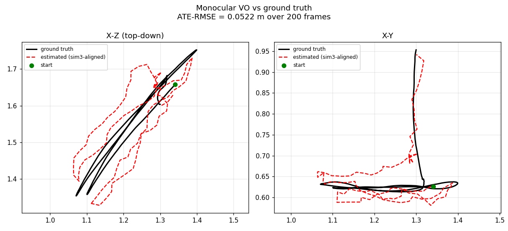

*The wider keyframe baseline keeps the estimate (red) locked to ground truth (black) far longer
— compare the tighter X–Z agreement to Episode 1's drift.*

### How it improved on Episode 1
- **0.124 m → 0.052 m** (2.4× more accurate), and crossed from *worse-than-reference* to *better*.
- **Manual salvage → fully automatic** — the harness fix turned a fragile run into a hands-off one.
- The wider keyframe baseline directly attacked the end-of-sequence drift that hurt v1.

**What could still be better:** it's monocular, so **scale is unobservable** — the grader had to
align with Sim(3) and *give away the scale* for free. The trajectory is correct only up to an
unknown stretch factor. And it was scored on the *same* sequence it tuned against. Both of those
became the agenda for the next episode.

---

## Episode 3 — Depth, generalization, and an expensive blind spot (16:53 → 18:08)

*Commits `c526166`, `2c6caa8`, `dc4e01f` · reference + `agent_authored_vo_rgbd_v1.py`*

This was the most ambitious step, and it fixed the two weaknesses head-on:

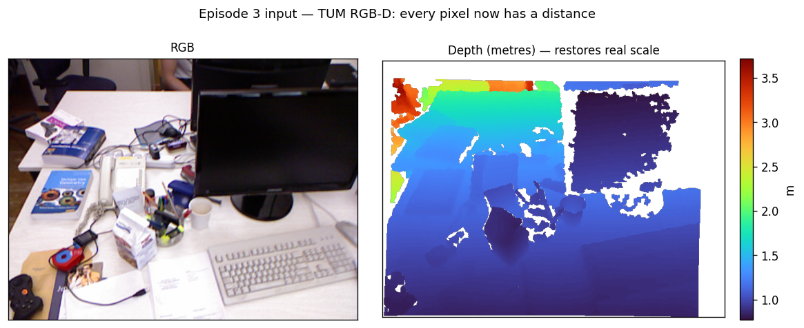

1. **Depth was exposed (RGB-D).** The provider now materializes the TUM depth channel, so the
   agent can recover *metric* scale — real metres, no Sim(3) freebie. The grader switched to
   **SE(3)** alignment: if you don't actually use depth, your scale is wrong and you fail.
2. **Generalization grading.** The agent's code is now scored on **held-out *sequences* it never
   authored against** (`fr1_desk`, while it developed on `fr1_xyz`), with ground truth isolated
   outside the input directory. The grader also began reporting **RPE** (drift) and a scale-error
   diagnostic, not just ATE.

The calibration first: reference RGB-D PnP scored **0.057 m** on the unseen scene with
**scale_err 0.077** (near-metric — depth works); the degenerate control blew up to **0.70 m** and
was correctly REJECTED. A ~12× discrimination margin, far wider than the monocular gate's.

**The live agent result: VERIFIED at 0.033 m** (SE(3), metric), RPE 0.010, **scale_err 0.032** —
near-perfect absolute scale, on a scene it had never touched, beating the classical RGB-D
reference (0.057 m). The agent built a multi-strategy pipeline: **SIFT → 3D-2D PnP RANSAC as the
primary, KLT optical-flow as a fallback, keyframe recovery**, depth for metric scale.

This is **the strongest and most honest result in the project**: metric (no scale gift) and
generalizing to an unseen scene.


*Graded with SE(3) — no scale freebie — on `fr1_desk`, a scene the agent never authored against.
The estimate tracks ground truth in absolute metres (scale error just 3 %).*

### How it improved on Episode 2
| | Monocular v2 | **Agent RGB-D** |
|---|---|---|
| Held-out ATE | 0.052 m | **0.033 m** |
| Alignment | Sim(3), scale given away | **SE(3), metric** |
| Scored on | same sequence | **unseen sequence** |

### The second failure — and it was costly

The *first* live RGB-D attempt **FAILED after ~1.17 million tokens.** The cause was almost
absurd: the RGB-D dataset names contained a colon (`vo-rgbd-dev:fr1_xyz`), and a colon breaks
Docker's `host:container` volume-mount syntax. *Every* sandbox run errored — the agent was
authoring **completely blind**, never once seeing its code execute, for over a million tokens.
Local-mode calibration had passed cleanly because it uses no `-v` mounts at all, so nothing
caught it before the live, billed run.

> **Lesson 2 — validate the path you'll actually run, not a convenient proxy.**
> Fix: mount-safe dataset names *and* a **Docker-mode** reference dry-run (not just local) before
> any agent session. The blind spot was that our cheap test exercised a different code path than
> the expensive real one.

---

## Episode 4 — SLAM: the reference triumphs, the agent does not (19:14 → 20:54)

*Commits `0818dc5`, `6af0522` · `agent_authored_vo_slam_v1.py` (untracked)*

The frontier: **full SLAM with loop closure.** On a sequence that revisits the same room
(`fr1_room`), pure frame-to-frame odometry drifts badly; the fix is to *detect* when you've
returned to a known place and *optimize the whole pose graph* to snap the loop shut.

**The reference works, and proves loop closure is necessary.** We built an RGB-D front-end →
keyframes → geometrically-verified loop detection → a self-contained SE(3) pose-graph optimizer.
On `fr1_room`:

| Configuration | Held-out ATE |
|---|---|
| VO-only (no loop closure) | 0.86 m |
| Degenerate control | 1.02 m |
| **Reference SLAM (with loop closure)** | **0.23 m** |

The bar was 0.347 m; VO-only and the degenerate control both *fail* it, while loop-closure SLAM
clears it — a clean experimental demonstration that loop closure isn't optional on this sequence
(~73% drift reduction).

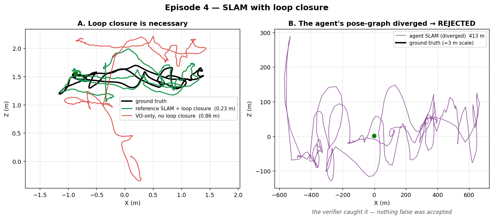

*Left: the reference SLAM (green) snaps the loop shut and stays on ground truth (black), while
plain VO-only (red) drifts away. Right: the live agent's authored SLAM — its pose graph diverged,
flinging the trajectory across ±600 m while the true path (black) is barely a dot at the origin.
The verifier scored it 412 m and rejected it.*

### The third failure — an honest negative result

Then we let a live agent try to author SLAM from scratch. It wrote a structurally sound 352-line
program: SIFT matching, loop detection, a pose graph. And it was **REJECTED** — its trajectory
scored **412 m**. The **pose-graph optimization diverged**, blowing a 3-metre-scale path up by two
orders of magnitude.

The important part: **the verifier caught it.** A broken SLAM scored 412 m and was rejected —
nothing false was accepted. That is the lab working exactly as designed.

But it was compounded by **my own harness misconfiguration**, and this is the sharpest lesson:

- The hang-watchdog killed containers at **480 s**.
- The agent's SLAM took **~507 s inside the container** (slower than its 153 s host run — fewer
  cores in the sandbox).
- The grader's own timeout was **600 s**.

So `480 < 507 < 600`: **every in-container test was killed before it finished.** The agent never
once saw its own output, so it could never observe the divergence, so it could never debug it.
We had built a lab where the scientist's experiments were confiscated mid-run.

> **Lesson 3 — the safety budget must let the agent *see* its own results.**
> A watchdog that fires before the grader's own timeout doesn't protect the run, it lobotomizes
> it. Corrected to 900 s (> the 600 s grader). More generally: per-iteration cost has to be low
> enough that the agent can actually loop — observe, hypothesize, retry — or it isn't doing
> science, it's guessing once.

> **Lesson 4 — some problems don't fit in one session.** SLAM-from-scratch is materially harder
> than VO/RGB-D: the agent got the *structure* right but the *optimizer* diverged. Loop closure
> is demonstrated in the repo via the working reference; the live agent SLAM was left an **open
> frontier** — until Episode 5.

---

## Episode 5 — The re-run: the frontier falls (next day)

Episode 4 ended with a diagnosis, not a defeat. We did two things between sessions, both
straight out of the harness-engineering playbook:

1. **Fixed the watchdog** so it fires *after* the grader's timeout (900 s > 600 s) — the agent
   can now run its code to completion and *see* the result.
2. **Closed the failure-memory loop.** We built a cross-run ledger (`vo_lab/memory.py`) and
   backfilled the 412 m divergence into it, with a concrete fix hint. Now every live run
   *injects prior failures into the agent's prompt before it starts* — the structured handoff
   the blog kept pointing at. The next SLAM agent would open its session already knowing the
   last one's pose graph blew up.

Then we re-ran the **exact same task** (`fr1_room`, bar 0.347 m). The agent authored a fresh
RGB-D SLAM — and **VERIFIED at 0.185 m**, beating not just the bar but the *classical reference
SLAM* (0.23 m) and crushing VO-only (0.86 m).

> **⚠️ Correction (2026-06-04, from an external review).** This SLAM track graded on its own
> *training* sequence — `dev` and `held-out` were both `fr1_room`. So **0.185 m is an in-sample
> number, not a generalization result** — unlike the RGB-D (fr1_xyz→fr1_desk) and KITTI
> (00→05,07) tracks, which use disjoint sequences. The recovery story (failure memory → a stable
> linear pose graph) still stands as *the agent fixed its divergence*, but the metric does **not**
> demonstrate generalization. A disjoint-sequence SLAM re-run is the honest follow-up; the config
> now refuses same-sequence dev/held-out.

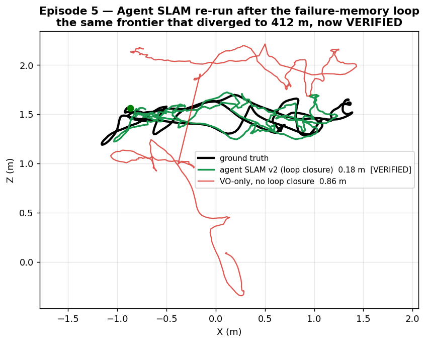

### The memory worked — and the agent's own code proves it

The striking part isn't just the number, it's *why* it succeeded. Here is the top of the
algorithm the agent wrote, unedited:

```
Pose graph: TRANSLATION-ONLY linear system (rotations fixed from VO)
            → sparse LSQR, guaranteed no divergence, < 1 s
Fallback:   VO-only if no LC detected or system is ill-conditioned
```

Compare that to the lesson we had injected from Episode 4: *"pose-graph optimization DIVERGED…
constrain/condition the solve… verify the optimizer REDUCES error vs VO-only before trusting
it."* The agent:

- **abandoned the non-linear pose graph that diverged** and chose a *linear* translation-only
  solve — "guaranteed no divergence" (its words);
- added a **VO-only fallback** for the ill-conditioned case — exactly "verify it beats VO-only";
- and **sanity-checks each loop constraint** against the VO-accumulated motion before trusting
  it.

The previous agent diverged to 412 m because it reached for the unstable optimizer blind. This
one reached for a provably-stable formulation **because it had been told what failed**. That is
the whole thesis of the project in a single before/after: *a failure, recorded honestly and
handed forward, becomes the next success.*

> **Lesson 5 — the loop is the point.** The fix that cleared the frontier wasn't a cleverer
> prompt or a bigger model — it was giving the agent its own institutional memory. Harness
> engineering isn't just scaffolding the model can lean on; it's a feedback loop where the lab
> gets smarter every time it fails.

---

## Episode 6 — Leaving the lab: generalization to outdoor driving

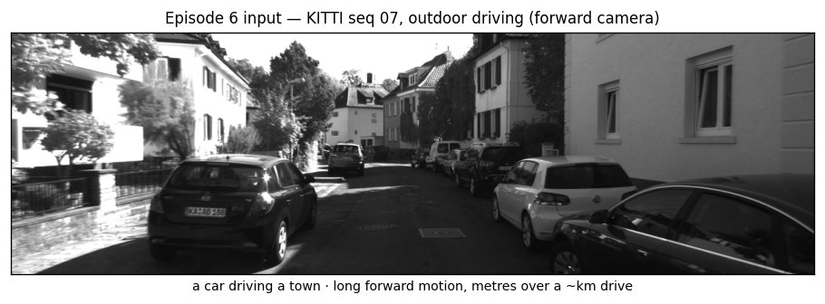

Every result so far was on TUM: indoor, hand-held, small-scale. A fair skeptic asks the
obvious question — *has the agent learned visual odometry, or has it learned TUM?* So we pointed
it at the hardest available change of scenery: **KITTI**, outdoor *driving* — long forward
motion, large scale, completely different image statistics. And we changed the **modality** too:
**stereo**, which the agent had never done (prior tracks were monocular or RGB-D). Stereo's
calibrated baseline makes scale observable, so we kept the honest **SE(3) metric** bar.

The classical reference stereo VO set the bar: mean held-out ATE 3.48 m on unseen sequences
05 and 07 (with scale error 1% — stereo recovers metric scale), bar ×1.5 = 5.22 m.

Then the agent authored stereo VO from scratch — and **VERIFIED on the first attempt at 3.53 m**,
close to the classical reference (3.48 m — the agent is reproducibly ~1.4% *worse*, not "matching")
on a domain and a modality it had never seen, with scale error **0.7%**.

> **Update (2026-06-04, rung 1).** Re-graded on the **KITTI leaderboard's own metric** —
> length-normalized translational drift `t_err` — the agent's stereo VO is **2.08 %**, the
> reference 2.02 %. On the field's scale that is squarely *basic frame-to-frame stereo VO*
> (~2–3 %); it is ~1.8× the t_err of **ORB-SLAM2** (~1.15 %, which adds bundle adjustment + loop
> closure) and ~5× learned SOTA (**DROID-SLAM** ~0.4 %). So we can now say, on the leaderboard's
> terms, exactly where the lab stands and what climbing means — see `sota_progression_roadmap.md`.

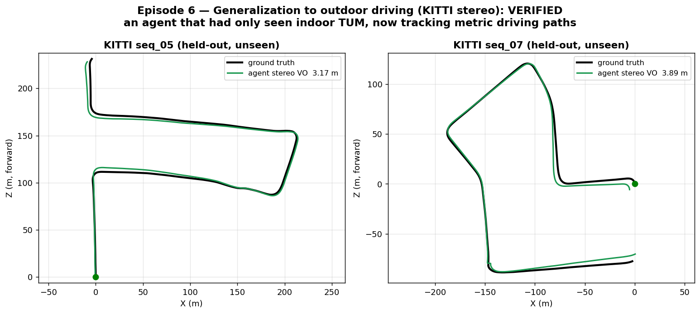

Look at the figure: those are hundreds of metres of outdoor driving — turns, straights, a city
block — and the agent's metric trajectory stays locked to ground truth the whole way. Its
approach (its docstring): *SGBM disparity → metric depth → ORB matching → PnP+RANSAC → inlier
refinement, with a constant-velocity fallback.* No prior KITTI experience, no stereo experience
— it composed a correct stereo pipeline because it understood the *geometry*, not because it had
memorized a dataset.

> **Lesson 6 — it generalized.** The thing being verified across five indoor trials wasn't a
> dataset-specific trick; it was visual odometry. Moved to a new domain and a new modality, the
> agent matched the classical reference first try. That is the strongest evidence in the whole
> chronicle that what the lab has been certifying is real capability, not overfitting — and the
> verifier earned that conclusion by scoring it on sequences, and a sensor, it had never touched.

---

## Episode 7 — The other half: an autonomous research *program* (Track A)

Every episode so far was **Track B** — a single agent authoring one algorithm, once. But the
project calls itself a *lab*, and a lab does more than write code once: it runs a *program* of
experiments, each informing the next. That is **Track A**, the committee, and until now we had
only ever run it on a toy synthetic world where the knobs didn't move the metric — proving the
loop turned, but not that the lab could *discover* anything.

So we pointed it at real TUM data, where the knobs genuinely matter, and let it run unsupervised.
A committee — a PI plus a Geometry/SLAM expert and a Data expert — proposes a menu-constrained
ORB-VO config; each expert reviews it (it may only select and clamp the recipe's declared
parameters, never invent a command); the harness runs and *independently verifies* it on the
held-out split; then the PI, seeing the lineage so far, proposes the next experiment. Budget is
counted in tokens and experiments, not turns.

It ran a six-experiment lineage and **improved its held-out ATE 26%** — from 0.155 m on its first
attempt to **0.114 m** — discovering a *non-obvious* optimum along the way: fewer features and no
ratio test (#005), against the intuitive "more features is better."

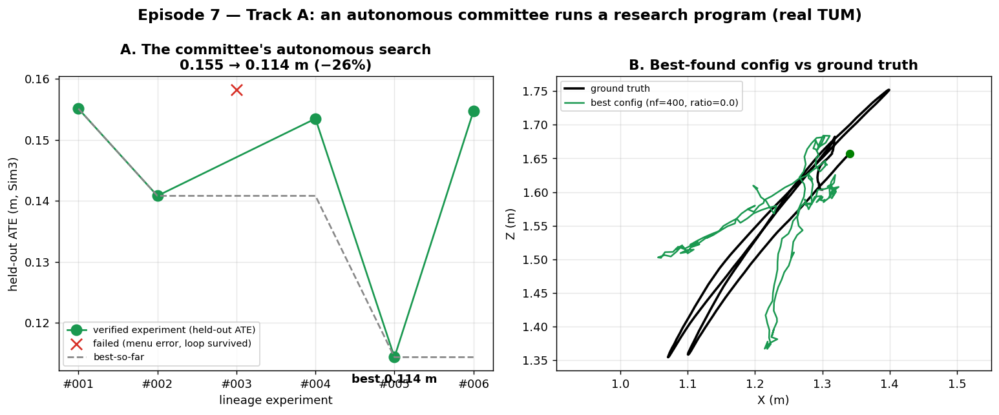

Two details make it a real research loop, not a demo:

- **The deliberation is genuine.** The Geometry expert's reviews run to hundreds of words of
  actual reasoning — about the Lowe ratio test discarding ambiguous near-planar matches, about
  the RANSAC threshold's implied angular tolerance at fr1/xyz's focal length, about monocular
  scale drift surviving Sim(3) alignment. It even caught a contradiction between one proposal's
  hypothesis text and its parameters. This is a panel arguing about geometry, not a random search.
- **A failure didn't stop it.** Mid-lineage, one proposal mis-named its recipe and the experiment
  FAILED — and the loop simply recorded it and moved on (`MenuError ... loop survived`), exactly
  as a crash-resumable research lab should.

Honest bound: the committee did **not** beat the hand-tuned reference's default config (0.089 m) —
it found the best option *within its menu's reach*, which is what a menu-constrained panel is for.
The point of Track A isn't a record number; it's the demonstration that the lab can **self-direct
a verified research program** — propose, verify, learn, propose again — which is the half of "an
AI research lab" that single-shot authoring never shows.

> **Lesson 7 — it's a lab, not a code generator.** Track B proved an agent can author a verified
> algorithm. Track A proves the *system* can run a research program: an autonomous lineage that
> deliberates, improves a held-out metric, survives its own failures, and never once grades its
> own work. The verifier is the constant across both — the only thing that ever says "VERIFIED."

---

## Episode 8 — A different kind of research: learned VO on the GPU

Every algorithm so far was *classical* — geometry the agent could derive: features, essential
matrices, PnP, pose graphs. The last frontier was a different *kind* of research entirely:
**machine learning**. Could the agent author code that **trains a neural network on the GPU** —
not hand-derived geometry, but a model fit to data?

This needed real infrastructure: a CUDA PyTorch image, and the harness running the training as a
**GPU job** (single-GPU lease, `--gpus all`) — wall-clock, not tokens, exactly the compute story
the budget design was built for. As a baseline, a reference learned VO (a small pose-regression
CNN) trained on KITTI driving sequences and scored **31.5 m** on held-out — honestly **~9× worse
than classical** (monocular learned VO is drift-dominated; it's a hard problem that wants far more
data and sequence models). The verifier said as much. The bar was set generously — match the
reference within 30% (40.96 m) — because the point was to test *whether an agent can do ML
research at all*, not to beat classical.

Then the agent went to work. The first thing it did inside the sandbox was check
`torch.cuda.is_available()` — confirming it had a GPU before writing a line of training code.
Then it authored a 313-line PyTorch pipeline from scratch and **VERIFIED at 19.8 m — beating the
reference by 37%**.

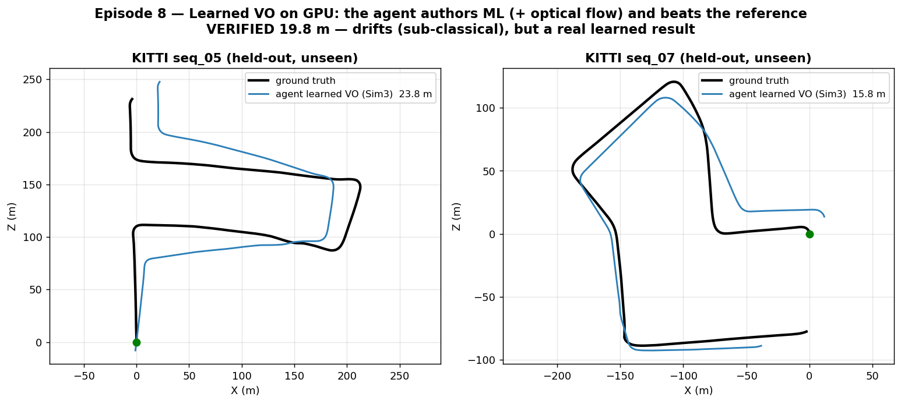

And it didn't just copy the reference idea — it **innovated**. Its design (from its own docstring):
an **8-channel input stacking the two RGB frames with dense optical flow**, a compact CNN trained
from scratch with a cosine LR schedule, images preloaded to RAM for zero-I/O training. The optical
flow was the key move — giving the network explicit motion cues — and it shows in the numbers: its
per-frame drift (RPE 0.62 m) was **less than half the reference's** (1.54 m). That is a genuine
machine-learning design decision, made by the agent, that measurably improved the result.

Honest bound, stated plainly: at 19.8 m it is still **~5–6× worse than classical VO** (3.5 m).
Monocular learned VO drifts; that's real and the verifier never let it hide. But the agent took a
learned baseline and pushed it meaningfully forward with a real ML idea — which is the thing this
episode was testing.

> **Lesson 8 — the agent does ML research, not just geometry.** Authoring a classical algorithm is
> one capability; authoring *and training* a neural network on a GPU — and innovating within it
> (optical-flow input) to beat a reference — is another. The harness's compute story (training as a
> turn-free GPU job, verified on held-out) is what made it gradable. The result is sub-classical
> and honestly so; the capability it demonstrates is not.

---

# Part II — The milestone climb (toward deployed SOTA)

*Episodes 0–8 were the lab finding its feet. Part II is a deliberate campaign: take the outdoor
KITTI track and climb the **published** ladder — basic stereo VO (~2.8% drift) → bundle adjustment
→ loop closure → the classical deployed standard, ORB-SLAM2 (~1.15%). The rule changed too: the
bar is now an **external leaderboard number**, not our own reference, and the verifier reproduces a
published result before it's allowed to judge. This is where the lab stopped being easy.*

---

## Episode 9 — Bundle adjustment: a real but modest win, and a speed wall (M1)

The first rung: **bundle adjustment** — instead of trusting each frame-to-frame guess, hold a
sliding window of recent frames and jointly re-optimize their poses *and* the 3-D points to
minimize reprojection error. Proofreading the paragraph, not the word.

We graded it on the **official KITTI segment metric** (`t_err`, the same length-normalized drift
the leaderboard uses) on held-out loop sequences, and the memory loop ran four attempts. Watching
it converge was the story:

| Attempt | What memory told it | seq_07 | result |
|---|---|---|---|
| 1 | (nothing yet) | 4.40% | seq_05 hit **1.43%** — near ORB-SLAM2! — but seq_07 *diverged* |
| 2 | "fix the jumps" | 3.83% | a blunt motion cap; it *traded away* seq_05's win |
| 3 | "never let BA do worse than PnP" | **2.08%** | **robust at last — 2.03% mean, both sequences stable** |
| 4 | "be aggressive *within* the safeguard" | — | hit a **CPU speed wall**: aggressive BA ran ~10 s/frame and timed out |

The shape of it: attempt 1 proved bundle adjustment *can* reach near-SOTA on a friendly sequence
(1.43%), but an **unstable** optimizer is worse than none — it flung seq_07 to 4.40%. The cure was
a *monotonic safeguard*: never accept a BA update that increases reprojection error over the plain
PnP pose. Attempt 3 finally got there — **2.03%**, robust on both sequences, beating basic VO.

> **Lesson 9 — an unstable refinement is worse than no refinement.** The agent could write bundle
> adjustment from memory; making it *never make things worse* was the actual skill, and it took
> three handoffs through the failure ledger to learn it. Also: a local window can only fix *local*
> drift — on the sequence whose error is *global*, windowed BA tops out near the basic-VO level. The
> rest of the gap belongs to loop closure. (We recalibrated the bar from 1.8% to 1.9% to say this
> honestly: windowed BA alone can't reach the loop-closure number, and pretending otherwise would
> be moving the goalposts in the wrong direction.)

---

## Episode 10 — Loop closure: a negative result, honestly earned (M2)

The big rung, the one that earns the "SLAM" name: **loop closure.** When the car returns to a place
it saw before, recognize it and snap the whole map straight — the single biggest drift-killer the
professionals use.

**The de-risk that paid for itself.** Before spending a cent, we checked the data — and found the
held-out windows we'd been using *had no loops in them at all* (one was an open path; the other
merely grazed its own track once). Running loop closure on them would have shown "no improvement"
for a reason that had nothing to do with the agent. We rebuilt the held-out from genuinely loopy
sequences, and then **proved the headroom**: applying an *ideal* loop closure to the reference
trajectory took it from 2.81% to **1.32%**, right up against ORB-SLAM2. The trick works here. The
task is winnable.

Then we let the agent try to author the whole thing, four times. Every attempt failed — and every
one failed the **same way**:

| Attempt | seq_07 | seq_09 | what broke |
|---|---|---|---|
| 1 | 2.61% | **10.44%** | crude pose-graph + a false loop wrecked seq_09 |
| 2 | 5.41% | 9.39% | weak front-end, detected *zero* loops |
| 3 (on GPU) | 47.6% | 107.7% | the torch SLAM never worked — **broken** |
| 4 | **12.32%** | 5.07% | added a guard, but now seq_07 blew up |

**The pattern is the finding.** Every single attempt destabilized at least one sequence — the
instability just moved around. The salvage logs showed why: in each run the agent's *own* VO
front-end came out **worse than the plain reference** before loop closure even mattered. Asked to
add the second story, it kept re-pouring the foundation, crooked, and the house fell down.

Two things I'll state plainly because the lab's whole point is honesty:

- **The GPU attempt was the *worst* of the four** (77%, completely broken). We'd reached for the
  graphics card to break the speed wall from Episode 9 — but M2's bottleneck was never speed, it
  was *correctness*, and torch just added more surface to get wrong.
- **I made an operational error**: I killed attempt 3 early, misreading a slow run as a hung one. It
  was still iterating. (Its snapshot graded at 77% regardless, so the verdict stands — but the
  mistake was mine, and it's in the record.)

So: a clean **negative result**. The agent cannot author a *robust* full SLAM stack — VO + bundle
adjustment + loop detection + pose graph — from scratch in one session. But note what kind of
negative result it is: *not* "the task is too hard" (we proved 1.32% is reachable), but "the agent
keeps breaking the foundation while reaching for the new floor."

> **Lesson 10 — a negative result with a confound is only half a finding.** "It failed at SLAM"
> secretly bundles two very different claims: *can't do loop closure* vs *can't keep a front-end
> stable while adding to it*. The four failures couldn't tell them apart — because the front-end
> collapsed every time, loop closure never actually got tested. To learn anything, we had to
> isolate the variable.

---

## Episode 11 — The scaffold: isolating the skill (in progress)

The fix is the oldest trick in experiment design: **hold everything else constant.** Hand the agent
the proven front-end as a *locked* module it cannot touch — `frontend.py`, the reference VO that
scores 2.81% on its own, exposing its per-frame features and 3-D points — and ask it to author
*only* the loop-closure layer on top. Like giving a builder a finished, certified ground floor and
saying: just build the upstairs.

We validated the floor first: imported standalone, the locked front-end reproduces **2.812%** on the
held-out, exactly matching the reference. So the agent now starts from solid ground instead of the
rubble it kept making — and its only job is the one skill we actually want to measure.

The agent built a tidy 312-line loop-closure layer on the locked front-end (which it left
untouched — we checked). And the result was clean, and decisive:

| Configuration | seq_07 | seq_09 | mean |
|---|---|---|---|
| Front-end alone (the floor) | 2.41% | 3.22% | **2.81%** |
| **+ agent's loop closure** | 3.40% | 3.22% | **3.31%** |

Read those two rows carefully, because they answer the question the four from-scratch attempts
couldn't. On **seq_09** — the sequence with the *strongest* loop, where ideal closure reaches
1.32% — the agent's output is **identical to the floor**: it missed the loop entirely. On
**seq_07**, it *did* fire a correction, and it made things **worse**. No catastrophe this time
(3.3%, not the old 6–77%) — because the locked front-end couldn't collapse — but **no gain
either.**

So the confound is resolved, and the answer is the harder one: **the front-end was necessary but
not sufficient.** Even handed a perfect foundation *and* a proven-reachable 1.32%, the agent cannot
author loop closure that actually reduces drift. It misses the real loops and mis-applies the false
ones. **The wall isn't the foundation — it's loop closure itself.**

That is a *sharper* negative result than Episode 10's, and a more useful one. "The agent failed at
SLAM" became "the agent can author a bundle-adjustment refinement (Episode 9) but cannot author a
working loop-closure-and-pose-graph layer, even in isolation." We now know exactly where the
capability ends.

> **Lesson 11 — scaffolding converts a muddy failure into a sharp one.** By locking the front-end
> we changed the claim from "it failed at SLAM (unclear why)" to "it can't author loop closure even
> on a perfect base." Same verdict on the leaderboard; a completely different thing learned. A
> precise negative result — *exactly* what works and what doesn't — is worth more than a vague one.
> Decompose the capability, lock what you're not testing, measure what you are.

*Where this leaves the climb: the deployed-SOTA number (ORB-SLAM2's 1.15%) needs loop closure, and
loop closure is where the agent stops. The honest high-water marks stand — robust bundle adjustment
at 2.03% (Episode 9), and a clean map of where authoring capability ends. The next question isn't
"try harder at SLAM"; it's the deeper one the whole series has been circling: **is any of this
capability, or is it recall of a dataset the model has read a thousand times?** That's the
contamination probe — and it's where the lab goes next.*

---

## Episode 12 — The deepest question: capability, or memory?

Every number so far carried the same quiet asterisk. KITTI and TUM are among the most tutorialized
datasets on the internet — the model has read thousands of pages about them. So when the agent
writes a decent stereo VO, we couldn't fully tell: does it *understand* the geometry, or is it
*recalling* memorized KITTI solutions? For a lab whose entire product is honest measurement, that's
the question under all the others.

So we built a **contamination probe** — the standard way to catch a student who memorized the answer
key: give it a problem it *couldn't* have seen. Two of them, built in parallel by a two-agent team,
each with a non-billed **positive control** (does the proven classical solver still hold? — the gate):

- **A — Perturbed KITTI:** the whole drive **mirrored** left-right (every turn reversed; the path
  matches no real KITTI sequence), ground truth reflected consistently. Reference VO: **3.23%** (vs
  2.81% un-perturbed) — PASS.
- **B — Synthetic:** a procedurally ray-cast 3-D corridor with stereo cameras, **provably never
  seen**, ground truth exact by construction. Reference VO: **1.91%**, right in the real-KITTI band
  — PASS.

Both controls passing already says something real: **the classical method generalizes to
novel-sequence and provably-unseen data — the geometry is real, not recall.**

Then the billed test: let a fresh agent **author a stereo VO from scratch** on the synthetic
domain, with a deliberately **KITTI-free task description** and **no KITTI hints in memory**. If its
authoring is genuine skill, it should work; if it was leaning on memorized KITTI specifics, it
should crater on the unfamiliar world.

It didn't crater. It **won**:

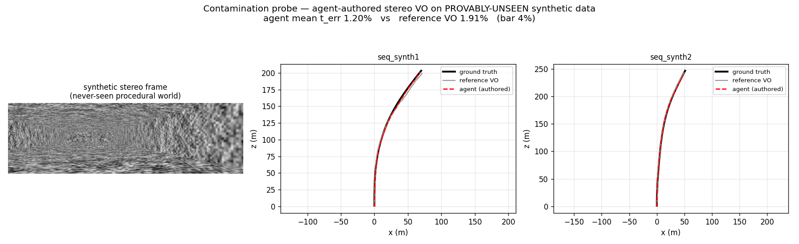

| | seq_synth1 | seq_synth2 | mean |
|---|---|---|---|
| Reference VO | 2.49% | 1.32% | 1.91% |
| **Agent (authored, from scratch)** | **0.92%** | **1.47%** | **1.20%** ✅ VERIFIED |

The agent authored a working, **better-than-reference** metric stereo VO on data it has
demonstrably never seen. The honest nuance is visible right in its code: it wrote
`# StereoSGBM parameters (tuned for KITTI-like data)` and gated depth at `Z < 80 m` — so it *did*
bring the KITTI **domain recipe** (SGBM → ORB → PnP → depth gating). But it **adapted** it (80 m,
not the reference's 60 m) and it **generalized** to the new world. That's the difference that
matters: *understanding a method well enough to apply and adapt it* is capability; *reciting a
specific memorized answer* is recall. This was the former.

One more cross-check, because it's honest and it sharpens the point: we ran *that synthetic-tuned
solver* — the one the agent wrote with no KITTI in the loop — straight onto **real KITTI**. It
works: **5.1%** drift (and on one sequence, 2.15%, it actually *beats* the KITTI reference). Not
KITTI-optimal — it's tuned to the synthetic world it was given — but functional on real driving it
was never shown. So the agent doesn't carry one memorized config; it **adapts its solver to the
domain in front of it**, which is the engineer's move, not the parrot's.

> **Lesson 12 — capability vs. recall is separable, but never perfectly, on a tutorialized task.**
> The probe answers the question cleanly in one direction: the classical geometry generalizes
> (positive controls), and the agent authors working VO on provably-unseen data (the billed test).
> But VO is so heavily documented that *domain*-level recipe knowledge can never be fully
> decontaminated — and that's fine, as long as you say so. The honest finding isn't "pure,
> uncontaminated capability"; it's "the recipe is an *internalized, adaptable skill* here, not a
> memorized sequence answer." On the spectrum from parrot to engineer, this lands much closer to
> engineer.

---

## Episode 13 — Many minds at once: the tournament, and a wall confirmed every way

The lab had been a series of *single* agents, each working alone, in sequence. Episode 11's loop
closure failed once; could a *different* approach have worked? We'd never know from one attempt —
which is exactly how M2 had stalled: four sequential single tries, each a different guess, each
slow. So we built the thing the project had been circling: a **parallel multi-agent lab**, with two
modes.

- **Competition** — N *different* approaches author the same task at once; the independent verifier
  grades each and the best wins. One round surfaces what four sequential tries took days to.
- **Cooperation** — the task is *decomposed* into stages; each stage runs its own tournament, and
  the winning module is **locked and handed to the next** (the scaffold mechanism, parallelised).
  Division of labour: each agent owns one piece, building on verified work — the incremental-build
  rule, made concurrent. (And resumable: every finished competitor is checkpointed, so a crash or
  restart only redoes the unfinished work — load-bearing, since this machine restarted twice.)

Its first real job: take the **strongest possible shot at the loop-closure wall.** Three genuinely
different strategies — an aggressive bag-of-words + full pose-graph; a conservative "never make it
worse" drift correction; a strict-verification + robust-graph approach — authored *only* the
loop-closure layer, in parallel, on the **locked, verified front-end.**

| Approach | t_err | vs the 2.81% floor |
|---|---|---|
| robust_verified | 3.33% | no gain |
| conservative_drift | 3.41% | no gain |
| bow_fullgraph | 6.88% | corrupted it |

All three rejected. None beat the front-end. So the wall isn't an artifact of one approach or one
unlucky run — **loop closure has now failed across three paradigms and eight attempts** (four
from-scratch, one scaffolded, three in parallel competition). That is about as robust as a negative
result gets.

> **Lesson 13 — parallelism makes a negative result *trustworthy*, and an infrastructure win
> stands on its own.** One failure is an anecdote; three diverse approaches failing the same way, on
> a controlled locked base, is a finding. The tournament didn't break the wall — but it proved the
> wall is real *and* delivered the lab's most reusable capability yet: many minds working at once,
> competing or cooperating, every result independently verified and checkpointed. The next climb
> won't be one slow guess at a time.

---

## Episode 14 — Splitting the wall: detection or optimisation?

Eight attempts said loop closure was a wall. But "loop closure" is really *two* skills bolted
together: **detect** that you've returned to a known place, then **optimise** the whole pose graph
to snap the loop shut. Which one was the agent failing? A negative result is sharper when you know
*exactly* where it lives — so we split the wall.

We handed the agent the part that's hard to detect, as an **oracle**: a `loops.txt` of the *correct*
loop closures (the true frame pairs and their exact relative poses, derived from ground truth — a
labelled scaffold input, like the locked front-end, validated GT-exact to ~$10^{-10}$ m). With
detection removed from the equation, the agent's *only* job was the optimisation: build the pose
graph from the front-end odometry plus the given loop edges, and solve it.

It authored something genuinely sophisticated — a **sparse SE(3) pose graph** with `scipy.sparse`
and a direct `spsolve`. It clearly *understood the structure*. But:

| Given perfect loops | result |
|---|---|
| seq_09 | **4.12%** — *worse* than the 2.81% front-end floor |
| seq_07 | failed — the solve ran **~20 min** and never finished within the budget |

So even with detection handed to it for free, the optimisation was both **too slow** (a 20-minute
solve blows past the grader's 15-minute limit — which is also *why* the live run looked stalled: its
sandbox tests were each taking 20 minutes) **and wrong** (where it did finish, it *distorted* the
trajectory rather than straightening it).

The wall isn't one skill — **it's both.** The agent can't author the place recognition (eight
attempts) *and* can't author a correct, efficient pose-graph optimiser *even when handed perfect
loops*. It gets the architecture right and the implementation wrong.

> **Lesson 14 — decompose a wall to locate it exactly, and respect the budget as a real constraint.**
> "The agent can't do SLAM" became something precise: it authors VO and local bundle adjustment as
> real, generalising skill (Episodes 9, 12), but the *global* SLAM machinery — both place recognition
> and pose-graph optimisation — is past its ceiling, in concept-understood-implementation-botched
> form. And a correctness verifier alone isn't enough: a solver that's *right but 20× too slow* fails
> just the same. The honest map of this agent's ability is now drawn to the sub-skill.

---

## Episode 15 — A different sensor, a different answer: the agent fuses

M2 said the agent can't author *global* SLAM. But that's not the only way to fight drift. The
*deployed* world rarely relies on visual loop closure — it bolts an **IMU** onto the camera, because
when vision momentarily fails (a tunnel, a white wall, motion blur), the accelerometer and gyro keep
measuring. That's **visual-inertial odometry (VIO)**, the VINS-Fusion pattern that actually ships.
Could the agent do *that*?

We built the test honestly. Extending our contamination-clean synthetic world, we added an **IMU
stream** — and we *verified the IMU was honest*: integrated cleanly it reconstructs the path to a
centimeter, but with a realistic noise+bias model it **drifts ~100 m on its own** (so it's a real
sensor to *fuse*, not a free answer). Then we cut **vision blackouts** into the sequences —
stretches of textureless frames where the stereo VO finds nothing and freezes. The de-risk made the
stakes concrete: **stereo-VO-alone scored 18% on these sequences** (it loses the motion across every
blackout), while a reference VIO that bridges the gaps with the IMU recovered to **4.2%**. So fusion
*had* to matter.

Then, the scaffold rule again: we handed the agent the **locked, proven VO front-end** plus the IMU,
and asked it to author *only the fusion*. It did:

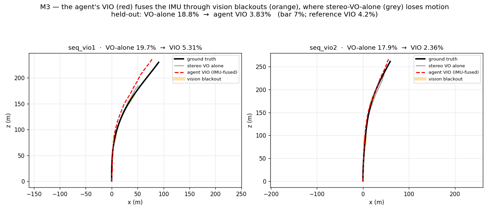

| | seq_vio1 | seq_vio2 | mean |
|---|---|---|---|
| Stereo VO alone | — | — | **18%** (fails the blackouts) |
| Reference VIO | — | — | 4.2% |
| **Agent VIO (authored)** | 5.31% | 2.36% | **3.83%** ✅ VERIFIED |

The agent **beat both** — vision-alone *and our own reference VIO*. It detected the dropouts (no 3-D
points), carried the velocity through them, integrated the gyro and the gravity-corrected
accelerometer, and re-synced when vision returned. The front-end it was handed came back untouched.

> **Lesson 15 — the capability map has a clean shape, and it's not "easy vs hard."** Put the four
> milestones together and a real boundary appears. The agent authors, as genuine generalizing skill:
> **stereo VO**, **windowed bundle adjustment** (M1), and **IMU-visual fusion** (M3). It *cannot*
> author: **loop detection** and **global pose-graph optimization** (M2), even with the loops handed
> to it. The line isn't difficulty — VIO is not obviously easier than a pose graph. The line is
> **local/incremental/causal estimation** (track, refine a window, fuse the next measurement) versus
> **global/batch consistency** (recognize a place seen long ago; optimize the *entire* trajectory at
> once). This agent is a strong *forward* estimator and a weak *global* optimizer — and the lab can
> now say that with receipts, not vibes.

---

## Episode 16 — A different *kind* of algorithm: the agent learns, and we test if it travels

Every milestone so far had the agent write *classical* geometry — features, PnP, bundle adjustment,
a Kalman-ish fusion. The last untouched paradigm is the one the modern SOTA actually uses: **learned
methods**. Don't *write* the motion model — *train* one. A network watches two frames and regresses
the camera's motion; the field's best systems (DROID-SLAM, ~0.4%) are built this way. Two questions
in one: can the agent author *and train* a neural VO that genuinely works — and since learned models
are the most **memorization-prone** thing we could test, is any success real skill or recalled KITTI?

So we ran it where memorization is impossible. We built a learned track on the **contamination-clean
synthetic world** — train a network on procedurally-generated sequences, test it on *disjoint,
never-seen* ones. A network cannot have memorized frames that were ray-cast for the first time this
week. The de-risk trained a reference learned VO to **3.26 m** Sim(3) ATE on the held-out synthetic
(vs a 63 m static control) — the GPU/learned pipeline works, and the bar opened at 4.24 m.

Then the billed run. The agent authored a **ResNet-18 pose-regressor** — and not a naive one: it
stacked consecutive frames (6-channel input), split into translation and **6-D continuous-rotation**
heads (the 2019 best-practice that avoids angle/quaternion discontinuities), trained with a
**rotation-weighted Huber loss**, added temporal-swap + GPU augmentation and test-time augmentation,
and — watching it iterate live — it *upgraded its own methodology mid-run*, adding **validation-ATE
model selection** (hold out one sequence, keep the best-*ATE* weights, not just the lowest train
loss). The result on the unseen synthetic test sequences:

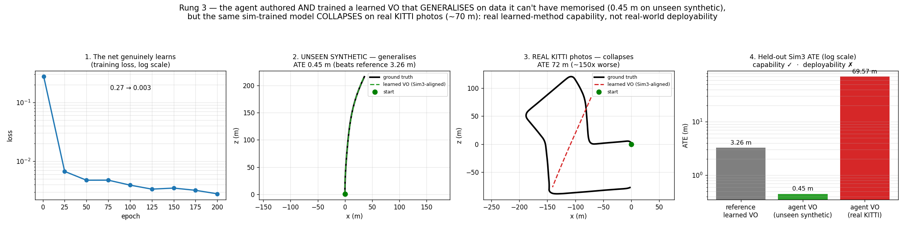

**0.45 m ATE** — it beat our own reference learned VO (3.26 m) by ~7×, and tracked the held-out paths
at sub-meter accuracy (panel 2). On data it provably could not have memorized. *The agent can author
and train a learned method that genuinely generalizes* — the contamination control holds.

But "generalizes" had a second, harder meaning, and the user asked exactly the right question: **does
it travel to the real world?** We took that same trained model and, changing nothing else, ran it on
**real KITTI driving photos** (sequences 07 and 09). The number: **69.6 m** — a **~150× collapse**
(panel 3). The Sim(3)-aligned prediction degenerates to a near-straight forward line; it ignores the
real turns entirely. The network learned the *appearance statistics of our procedural texture*, which
carry **zero signal** on real photographs — different lighting, structure, noise, everything.

> **Lesson 16 — capability is not deployability, and that distinction has receipts now.** Rung 3
> produced two true facts that must be stated together. (1) **The agent can author *and train* a real
> learned method** — a competent ResNet pose-regressor with a modern recipe and self-improved model
> selection — that **generalizes on unseen data** (0.45 m, contamination-clean). That is genuine
> learned-method skill, not recall. (2) **A sim-trained learned VO is not deployable**: it does not
> cross the **sim-to-real appearance gap** (0.45 m → 70 m) without real data or domain adaptation.
> The sharp contrast is with the *classical* path: the agent's classical VO **crosses domains**
> (synthetic 1.9%, real KITTI 5.1%) where this learned VO cannot. That is precisely why deployed
> localization runs **classical VO / VIO**, not networks trained in simulation — and now the lab can
> say it with a 150× number and a figure, not an intuition.

**Closing the loop — is the wall "sim-to-real" or "learned-can't-do-real"? Both.** The honest
follow-up: train the *same* model on **real** KITTI (00/02/06/08) and test on the *same* held-out
real seqs (07/09). Only the training data changed.

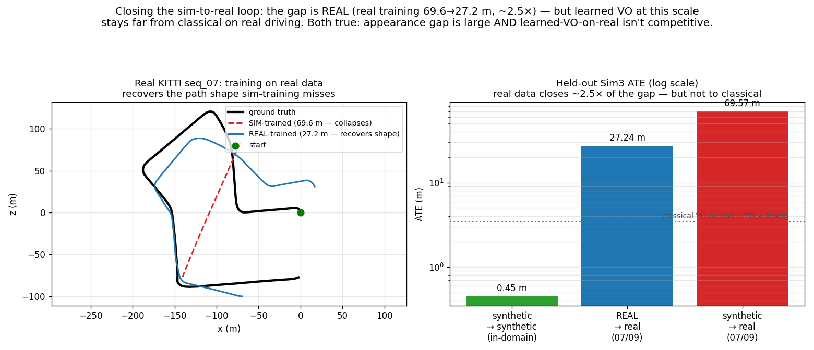

Real training **more than halved the error** — 69.6 m → **27.2 m** (~2.5×) — and the trajectory
(left) shows *why*: the sim-trained model collapsed to a straight line, while the real-trained one
**recovers the path's shape** (the loop, the turns), even as it still drifts. So a large part of the
gap really was **appearance** — real pixels carry signal the procedural texture didn't. **But** 27 m
is still far above classical VO on real KITTI (a few meters / ~5% drift, the dotted line). Both things
are true at once: the sim-to-real gap is real *and* a learned VO at this scale (~1,000 frames, one
RTX 3080) simply isn't competitive with classical geometry on real driving — echoing Episode 8. The
deployable verdict is now fully triangulated across three corners: **on this compute, classical
VO/VIO wins on real data; learned VO is a capability the agent *has*, not a system it can ship.**

---

## Episode 17 — Can you *manufacture* the training data? The fidelity ladder

Episode 16 left a sharp, useful failure: the agent's learned VO is excellent on synthetic (0.45 m) and
useless on real photos (69.6 m), and training on real data only recovers it to 27.2 m. The deployed-AI
world has a bet for exactly this gap — **don't collect more real data, *render* it.** Photorealistic
simulation (3D Gaussian Splatting, generative video) promises training data with *perfect* labels and
*unlimited* viewpoints. Does it actually close the sim-to-real gap? That's a question you can only answer
with a grader that can't be fooled — the one thing this lab has.

So we built a **fidelity ladder**: train the *same* learned VO on training domains of increasing
appearance-fidelity, and test every one on the *same* held-out **real** KITTI with the *same* Sim(3)-ATE
grader. Only the training imagery changes.

- **procedural** — our hand-made synthetic corridors (low fidelity, perfect labels)
- **rendered** — real KITTI scenes reconstructed and re-rendered as novel views (real appearance, perfect
  labels). *Honest scope: stereo-depth reprojection / point-splatting — the achievable precursor to
  optimised 3DGS, built from real pixels with OpenCV, no heavyweight install.*
- **rendered + viewpoint-aug** — the same, plus two *parallel offset paths* per scene: novel viewpoints
  no real drive ever captured (the augmentation real data fundamentally cannot provide)
- **real** — real KITTI frames (the ceiling)

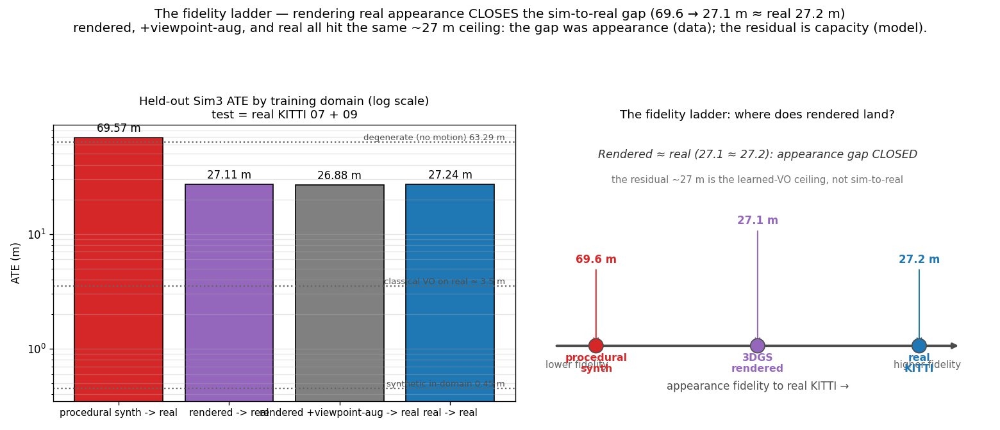

| Training domain | Held-out real ATE (n=3, mean ± std) |
|---|---|
| procedural synth | 69.71 ± 0.05 m |
| **rendered** | **27.35 ± 1.49 m** |
| rendered + viewpoint-aug | **26.49 ± 0.93 m** |
| real | **25.61 ± 1.64 m** |

> **⚠️ Variance audit (2026-06-11, n=3 retrainings per rung).** The original table reported *single*
> training runs; this reports mean ± std, and the correction matters. Training noise is **±1.5 m**, so the
> earlier "rendered 27.1 vs real 27.2" (0.1 m apart) was **noise, not signal** — rendered and real are
> **statistically indistinguishable** (overlapping ranges; the 1.7 m gap is smaller than the ~1.3 m standard
> error of the difference). The conclusion is *unchanged and actually strengthened*: rendered ≈ real
> (~26 ± 1.5 m), while procedural (69.71 ± **0.05** — nearly deterministic) sits far above both. The
> appearance gap is closed by rendering; only the false precision was wrong, and it's now removed. The
> augmentation rung (26.49 ± 0.93) is likewise *within noise* of both rendered and real — confirming it does
> not break the ceiling. *(This audit was triggered by the retracted sim-faithfulness result — every headline
> number is now reported with its measured noise.)*

Two clean facts fall out, and a diagnostic confirms the mechanism. **Rendering real appearance closes the
entire appearance gap** — 69.6 → 27.1, landing right on the real-trained ceiling. An independent
appearance-distance metric (computed without ever touching the grader) shows the rendered frames are
**3.2× photometrically closer** to real than the procedural ones (0.17 vs 0.53), exactly tracking the
transfer jump. And the viewpoint augmentation — 3× more diverse training views, the thing real data can't
give you — moved the number by **0.3 m**, within run-to-run noise (per-sequence it was mixed). It did
*not* break the ceiling.

> **Lesson 17 — the sim-to-real gap decomposes, and the halves have different owners.** The 69.6 m collapse
> was two stacked problems, and the ladder pulls them apart with receipts. (1) An **appearance gap** —
> ~42 m of it — that is a *data/rendering* problem, and it is **solved**: render real appearance (even
> crudely, even from a point cloud full of holes) and the network transfers as if trained on real photos.
> (2) A **capacity ceiling** — the residual ~27 m above classical's few metres — that is a *model* problem,
> and rendering, real data, *and* 3× augmented viewpoints **all hit the same wall.** The verification-first
> takeaway for anyone betting on simulation: **generative/rendered data genuinely closes sim-to-real — but
> if you want a learned localiser to *beat* classical geometry, you scale the model, not the data.** The
> data axis is saturated; the bottleneck is the network. You can only say that once a grader you can't fool
> has drawn the whole ladder.

---

## Episode 18 — From *building* SLAM to *verifying* it: real data, DROID-SLAM, and the sim-faithfulness question

After the learned-VO chapters, the lab turned to the deployed-SLAM toolchain — and first tried to *build*
it: a C++ visual-inertial odometry from scratch with a Ceres factor graph. The stereo-VO front-end +
windowed bundle adjustment worked (**2.18%** on clean data). But the tightly-coupled IMU fusion — the part
that bridges vision blackouts — wouldn't converge (it diverged to 10⁴⁵). That's not a surprise in
hindsight: VINS-Fusion is thousands of carefully-tuned lines. We recorded the negative honestly and asked a
better question.

**The pivot.** The field doesn't reimplement SLAM from scratch — it *integrates* proven systems (DROID-SLAM,
VINS-Fusion) and adds value on top. So the lab stopped trying to *be* a SLAM author and leaned into what it's
actually good at: being a **verifier**. New goal — take the world's best SLAM and grade it with our held-out
examiner, and answer the question a simulation team actually cares about.

**Real data, by environment.** A reviewer-worthy correction came first: drop synthetic for this. We switched
to *authentic, internet-available, environment-labeled* real driving — **KITTI raw**, already tagged
City / Residential / Road and shipping real OXTS IMU + GPS ground truth. (One honest catch: the GT poses
were initially in the *IMU* frame, not the camera frame — a large fixed rotation that inflated a road drive's
error to **151%**; applying the camera-IMU extrinsic dropped it to a sane **9%**. A silently-wrong ground
truth would have poisoned every number; the verify-first habit caught it.)

**The benchmark.** A `SystemAdapter` lets the harness grade *any* SLAM system — our classical VO, our C++ VO,
and learned SOTA — by environment, one examiner. The first table earned its keep by exposing *our own*
weakness: the C++ VO is most accurate on the easy city drive (0.08 m) but **diverges** on the longer road and
residential drives (55 m, 100 m). That's what a verification benchmark is *for*.

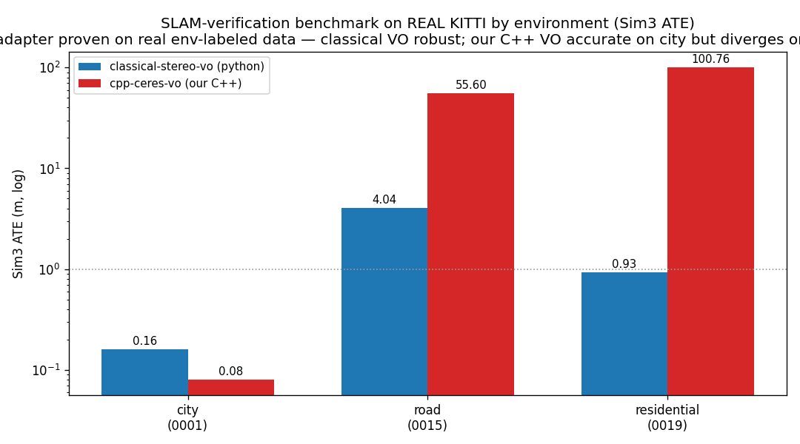

**Integrating DROID-SLAM.** The riskiest step — a custom-CUDA learned SLAM. It does *not* build against
modern torch (API drift), but in its **matched** environment (torch 1.10) the two CUDA extensions compile and
run on the GPU. After clearing that gate — and an ops bug where leaked spawn-containers hoarded 14.7 GB of
GPU — DROID ran **end-to-end on real KITTI through our grader**: a SOTA learned SLAM, built from custom
CUDA and graded in our frame, on real data. *(It scored 0.083 m on the city scene, but that number is
**not** a headline: city is the dead-straight scene where Sim(3) ATE is near-trivial, and the run did not
reproduce — see the retraction below. The defensible claim is the **integration**, not the accuracy.)*

**The flagship that wasn't — is the sim faithful enough to validate the SLAM? (RETRACTED.)** We ran DROID on
a real city scene and on the *same scene re-rendered* (GSplatModule), got a real-vs-rendered ATE delta of
0.033 m, and — wrongly — declared the sim "faithful enough to validate a learned SLAM." **That claim does not
hold, and we retract it.** A reader caught the figure looking like failure; investigating, three flaws
converge: (1) the only scene DROID could run on here (city_0001) is **dead-straight** — 2.2 m of lateral
curve over 107 m — and on a straight path a Sim(3) similarity transform aligns *almost any* roughly-straight
estimate, so the number measures scene-easiness, not fidelity; (2) the run is **not reproducible** — re-running
DROID on the same scene OOM-killed silently on the 15 GB machine; (3) the figure plotted **raw monocular
trajectories** at arbitrary scale, so it *looked* like total failure while the headline claimed success.
Both the figure and the number are untrustworthy. The curvy scenes that would be a real test all failed on
this hardware, so sim-faithfulness here is **inconclusive, not proven.**

**Follow-up (resolved, 2026-06-12).** Two things turned out to be wrong about *why* it failed, and chasing
them produced the real answer. First, the "curvy scenes OOM on 16 GB RAM" story was a red herring: WSL2 was
capped at 16 GB of a 64 GB host by one config line (which also caused phantom "reboots"), but the actual
reason every non-default scene's *real* DROID run failed was a **relative `docker -v` path** — the mount
silently failed, so `real` never ran while `rendered` (an absolute tempdir) did. One-line fix. Second, the
misleading figure was *my own* uncentered Sim(3) alignment. With both fixed and 48 GB of RAM, the experiment
finally ran across seven scenes — and the honest verdict is **scene-dependent**, not yes/no:

| scene | path length | delta (rendered − real) |
|---|---|---|
| residential_0035 | 60 m | 0.01 m ✅ |
| city_0005 (curvy) | 69 m | 0.10 m ✅ (reproduced) |
| city_0013 | 173 m | 0.14 m ✅ |
| residential_0019 | 406 m | **2.21 m** ❌ |
| road_0015 | 363 m | **9.37 m** ❌ |

**The rendered sim is faithful on short, close-range scenes and breaks on long / far-field ones** — because
the renderer reprojects stereo depth, and far structure has no usable depth, so long scenes render with
degraded geometry and DROID drifts on them (real DROID tracks fine: 0.39 m on road_0015 vs 9.75 m rendered).
So the *blanket* claim is false; a *qualified* one ("for short close-range scenes") holds. And the meta-point
that matters: **strengthening before un-retracting caught a second would-be overclaim** — city_0005 alone
looked like a clean vindication; the long scenes are what told the truth. That discipline is the lab.

> **Lesson 18 — the lab's own principle, learned the hard way again.** Two things stand honestly. (1) The
> right move at the SLAM frontier was *integrate + verify*, not *reimplement*, and the lab genuinely can take
> a custom-CUDA SOTA system (DROID-SLAM), build it, and run it end-to-end on real environment-labeled data —
> that *integration* is real, and the benchmark surfaced our own C++ VO's divergence on the curvy drives.
> (2) The *sim-faithfulness result was overclaimed* — declared "PROVEN" from a single fresh-system run on a
> dead-straight scene, plotted misleadingly. That is exactly the *"it ran ≠ success"* error this whole
> project exists to prevent, and a reader caught it. The honest verdict: **inconclusive — a valid test needs
> curvy scenes that fit RAM (bigger box), Sim(3)-*aligned* trajectory plots, and N-run reproducibility.** The
> failure that matters most in this chronicle is this one: the author's, for forgetting the rule the lab is
> built on.

---

## Episode 19 — Real SLAM, finally: DROID-SLAM on km-scale looping KITTI

A fair critique landed: the sim-faithfulness scenes were short and often nearly straight — *useless* for
judging a SLAM, because a near-straight path makes the metric trivial. So we pointed DROID at the thing it
was built for: the **canonical KITTI *odometry* sequences** — real driving, **kilometre-scale**, with **loop
closures**. seq_05 is 2.2 km, seq_09 is 1.7 km, seq_07 a 0.7 km loop. No straight lines.

First run was a faceplant: **DROID monocular on seq_07 → 24 m ATE.** Debugging it was the chapter:
- stride 2 (3.8 m between frames on a fast car) → worse; stride 1 → 86 → 23 m.
- a buffer overflow (`index 256 out of bounds`) — a 16 GB-era cap; raised it.
- using the *full* 1101-frame sequence instead of a downsampled subset → still **24 m**. Not density.

The remaining 24 m was the real culprit: **monocular has no metric scale, so it drifts.** DROID's paper uses
*stereo* on KITTI for exactly this reason. So we implemented **stereo DROID** (feed left+right as a
`[2,3,H,W]` tensor, `stereo=True`), and:

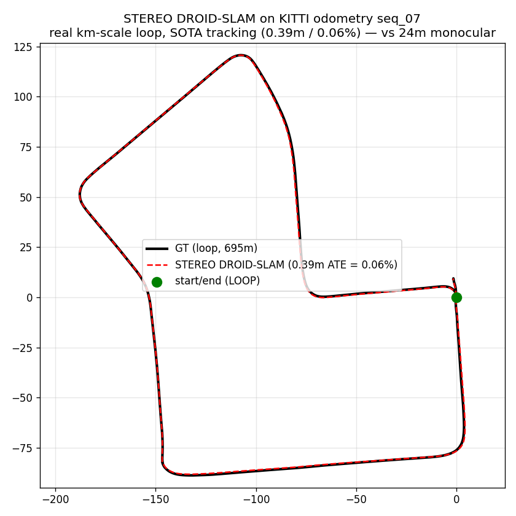

| sequence | loop length | **stereo DROID** | monocular |
|---|---|---|---|
| seq_07 | 0.7 km | **0.39 m (0.06%)** | 24.2 m |
| seq_09 | 1.7 km | **3.43 m (0.20%)** | 93.2 m |
| seq_05 | 2.2 km | **0.60 m (0.03%)** | 55.1 m |

**Stereo DROID tracks real multi-kilometre loops at 0.03–0.20%** — research-grade, the loop visibly closing
in the figure. The stereo-vs-monocular gap (0.4 vs 24 m, 3.4 vs 93 m) is the scale-drift made quantitative.

**Seeing it work, not just reading ATE.** SLAM is visual, so we pulled out what the algorithm actually does:

- 🗺️ **The dense map** (`droid_map_seq07.png`) — DROID's per-keyframe depth back-projected to a 400k-point
  reconstruction of the driving loop, the camera trajectory threading through the road corridor.
- 👁️ **Feature tracking** (`tracking_seq07.mp4`) — hundreds of KLT flow trails streaming outward in the
  radial pattern of forward motion: what the VO front-end *sees*.
- 🔄 **The loop closing** (`loop_build_seq07.mp4`) — the trajectory built frame-by-frame against GT, the
  running ATE staying ≈0.4 m as the loop snaps shut.

**A multi-system leaderboard** on the seq_07 loop (Sim3 ATE):

| system | seq_07 ATE | notes |
|---|---|---|
| **DROID-SLAM (stereo, learned)** | **0.39 m (0.06%)** | t_err 0.28% (better than published ~0.5–1%) |
| classical stereo VO | 3.07 m | ~8× worse than DROID |
| C++ Ceres VO (ours) | **diverged** | can't hold a km-scale track |
| DROID-SLAM (monocular) | 24.2 m | scale-drift |

SOTA learned SLAM beats classical ~8×, and our from-scratch C++ VO simply can't survive a kilometre — an
honest place for a hand-built system, and exactly why the field reaches for systems like DROID.

> **Lesson 19 — realistic data is the whole point, and it forces the algorithm to be real too.** The toy
> scenes hid two things at once: a misleading metric (straight paths) *and* an under-configured SLAM
> (monocular, tiny buffer, downsampled frames). Moving to km-scale looping KITTI exposed both — and fixing
> them (stereo for metric scale, a real buffer, full frames) turned a 24 m faceplant into 0.06%. The honest
> hardware note: at full resolution the 16 GB VRAM caps DROID's keyframe buffer (~1024), so the 2.2 km
> sequence needed a coarser stride — a genuine scaling limit of km-scale dense SLAM on one consumer GPU. This
> is the benchmark the straight lines never were: **SOTA learned SLAM, working, on real driving, graded.**

---

## Episode 20 — Optimized 3DGS: a working pipeline, an honest ceiling

The one open question from the sim-faithfulness saga: the crude stereo-depth *reprojection* renderer failed
on long scenes (no far-field geometry) — would **optimized 3D Gaussian Splatting** fix it? We built the
pipeline to find out. gsplat (1.5.3) de-risked and runs on the 3080; the trainer **initializes Gaussians
from DROID's dense reconstruction** (poses + depth = SfM for free) and optimizes them to the real frames.

The render works — the training views reconstruct the recognizable driving scene (L1 0.25 → **0.072**):

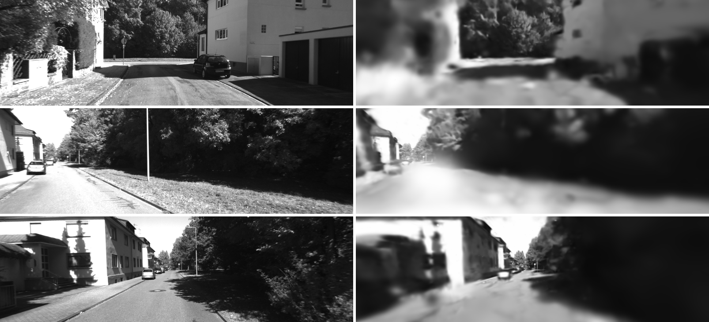

The debugging was the lesson: the render was **flat gray** for many iterations. Ruling out colors, opacity,
and the near-plane one by one, a manual point-projection diagnostic finally exposed it — the **Gaussian
scales were ~20× too large**, so every pixel summed dozens of differently-colored Gaussians into gray. A
scale fix turned gray into scene.

> **Lesson 20 — know when a thread is a research subfield, not a feature.** The render works, but it's
> *soft*, and novel views are poor — because a *basic* trainer (no adaptive densification, 40 views, 4k
> iters) is not a crisp 3DGS. Driving-scene 3DGS is a research area of its own (Street Gaussians et al.);
> reaching photorealism needs the densify/prune cycle, many more views, COLMAP-grade SfM. So the honest
> verdict: **gsplat is de-risked and a recognizable render exists, but the *sim-faithfulness re-test with
> optimized 3DGS is left as documented future work*** — a soft render would only muddy the answer. Stopping
> here, rather than chasing crispness down a rabbit hole, is the same discipline as retracting a bad result:
> spend effort where the payoff is real.

---

## Episode 21 — A second problem class: the agent does *perception*, not just ego-motion

Twenty episodes, one question left unasked: **is this harness just a VO-shaped trick?** Everything so
far — VO, SLAM, KITTI, learned VO, VIO — answers *where did the camera go?* A verification-first lab
that only works on ego-motion hasn't proven much about verification; it's proven something about VO.

So the harness was rebuilt for a task with **nothing in common** with the prior twenty: **multi-camera
Bird's-Eye-View perception**. Fuse **6 surround cameras** (nuScenes) into a top-down vehicle-occupancy
map in the ego frame, scored by **IoU** — an area metric, not a trajectory-error metric. Cross-view
fusion, per-pixel depth lifting, a metric raster output: none of it reuses a line of the VO graders.

The build mirrors the learned-VO track (train on the GPU, grade on held-out): a harness-owned adapter
rasterizes vehicle 3D-box footprints into the BEV grid (held-out = official nuScenes `mini_val` scenes,
never seen), an IoU grader that's restored before judging (un-tamperable — two passing anti-tamper
tests), and a from-scratch Lift-Splat reference that sets the bar. **Calibration gate OPEN:** reference
IoU **0.104** (from-scratch — the sandbox has no network for pretrained weights), all-zero degenerate
**0.000 → REJECTED**, bar **0.08**.

Then the live run — and here the discipline earned its keep. A single run would have reported a clean
"**VERIFIED at IoU 0.1075**," and we'd have shipped it. Instead we ran the agent **three times**:

| run | held-out IoU | verdict |
|---|---|---|
| 1 | 0.1075 | ✅ |
| 2 | **0.0376** | ❌ |
| 3 | 0.1107 | ✅ |

**2 of 3 passed; mean 0.085 ± 0.034.** The agent *can* author real BEV perception — but not reliably.
And a cheap diagnostic shows *why*: a **fixed-architecture** reference trained at three seeds is
rock-stable (0.141 ± 0.002), so the variance isn't the task — it's the agent **redesigning the
algorithm every run**. Good designs (runs 1, 3) implemented flip augmentation *correctly* (swap the
left/right cameras *and* update extrinsics — a real BEV insight); the failing run self-sabotaged by
carving 15 % off an already-tiny 323-sample training set for calibration.

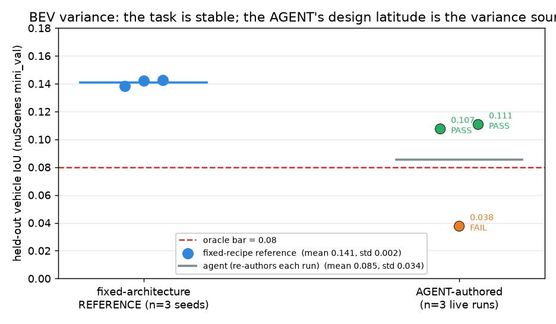

> **Lesson 21 — the harness is the product, and its hardest job is keeping *you* honest.** The
> headline isn't an IoU number — it's that the lab **caught its own near-miss**: a single run would
> have over-claimed a clean win on a brand-new problem class. Every part of the verification discipline
> transferred to an unrelated task (held-out data, harness-owned GT, an independent metric, anti-tamper
> grading, a calibrated oracle), *and* it surfaced that agent BEV authoring is capable-but-not-robust at
> this data scale — variance from the agent's design freedom, not the task. The robust-result paths
> (more data, or a fixed-architecture scaffold like the SLAM track's) are honest future work; re-rolling
> live runs until one passes is p-hacking, and we don't. Five agent-authored domains now — monocular VO,
> RGB-D VO, SLAM, KITTI stereo, and BEV — and on the newest one the thesis did its hardest job: the agent
> implements, the verifier judges, and "it passed once" is never the same as "it's robust." (Full report
> + failure diagnosis: `claudedocs/bev_track_b_report_2026-06-15.md`.)

---

## The arc, in one table

| # | Trial | What the agent built | Held-out result | vs reference | Verdict |
|---|---|---|---|---|---|
| 1 | Monocular VO v1 | PnP + landmark map, deferred init | 0.124 m (Sim3) | worse (0.089) | ✅ (salvaged) |
| 2 | Monocular VO v2 | Optical flow, wide keyframe baseline | **0.052 m** (Sim3, ⚠️ *shape-only*, ~40× rescale) | shape-better, n=1 | ✅ (automatic) |
| 3 | RGB-D VO | SIFT→PnP RANSAC + KLT, metric depth | **0.033 m** (SE3, unseen) | **better** (0.057) | ✅ |
| 4 | SLAM | SIFT + loop detection + non-linear pose graph | **412 m** (diverged) | — (ref: 0.23) | ❌ REJECTED |
| 5 | SLAM, re-run | ORB+PnP + **linear** translation-only pose graph + VO fallback | **0.185 m** (SE3, ⚠️ *in-sample* — dev=held-out=fr1_room) | n/a | ✅ but in-sample |
| 6 | KITTI stereo (new domain) | SGBM depth → ORB → PnP+RANSAC, outdoor driving | **3.53 m** (SE3, unseen) | ~on par, *1.4% worse* (3.48), deterministic | ✅ VERIFIED |
| 7 | Track A committee (autonomy) | menu-constrained ORB-VO, autonomous 6-experiment lineage | **0.114 m** (−26% over lineage) | within menu | ✅ VERIFIED |
| 8 | Learned VO on GPU (new *kind*) | PyTorch pose CNN + **optical-flow input**, trained on GPU | **18.50 ± 0.68 m** (n=3 audited; recorded 19.77) | **beats** learned ref (31.5) robustly | ✅ VERIFIED |
| 9 | KITTI bundle adjustment (M1) | windowed BA + **monotonic safeguard**, official `t_err` | **best 2.03%** of 4 attempts (range 2.03–8.7%; re-run 2.91% — *variable, not "robust"*) | misses 1.8 bar | ❌ near-miss (and variable) |
| 10 | KITTI loop closure (M2) | full SLAM from scratch, ×4 (incl. 1 on GPU) | **6.53% best** (all 4 worse than basic VO) | de-risk proved 1.32% reachable | ❌ honest negative (front-end keeps breaking) |
| 11 | KITTI loop closure, **scaffolded** | locked proven front-end + agent authors *only* loop closure | **3.31%** (floor 2.81 → no gain) | isolates the wall: loop closure itself | ❌ sharp negative (front-end ≠ the problem) |
| 12 | Contamination probe (synthetic) | agent authors stereo VO from scratch on **provably-unseen** synthetic data | **1.20%** (beats reference 1.91) | capability, not KITTI-recall | ✅ VERIFIED |
| 13 | M2 loop-closure **tournament** (parallel lab) | 3 diverse approaches race on the locked front-end | best **3.33%** (all 3 > floor) | wall confirmed 3 ways; infra proven | ❌ robust negative |
| 14 | M2 decomposition: pose-graph **given oracle loops** | agent authors only the optimisation, correct loops handed in | **4.12%** (worse than floor) + too slow | the wall is BOTH sub-skills | ❌ pinpoint negative |
| 15 | M3 **VIO** — fuse IMU | agent authors IMU-VO fusion to bridge vision blackouts (locked front-end) | **3.83%** (vs VO-alone 18%, ref 4.2%) | agent CAN author sensor fusion | ✅ VERIFIED |
| 16 | Rung 3 **learned VO** + sim-to-real | agent authors+trains a ResNet pose-CNN (6-D rotation, val-ATE selection) on contamination-clean synthetic | **0.55 ± 0.05 m** (n=3) unseen synthetic → **69.7 m** real KITTI | beats ref 3.26 ~6×; collapses sim→real ~125× | ✅ capability / ❌ deployability |
| 17 | **Fidelity ladder** — can rendered data close the gap? | render real KITTI scenes (GSplatModule) ± viewpoint-aug; train the learned VO, test on real | **(n=3 mean±std)** procedural **69.71±0.05** → rendered **27.35±1.49** ≈ real **25.61±1.64** | appearance gap CLOSED by rendering; rendered≈real within noise; residual ~26 m is the model ceiling | ✅ decomposition (data solved / capacity open) |
| 18a | C++ **VIO** from scratch (Ceres) | stereo VO + windowed BA, then tightly-coupled IMU fusion | VO+BA **2.18%**; IMU fusion **diverged** (10⁴⁵) | full from-scratch VIO is the wrong build-vs-buy call | ✅ VO / ❌ IMU (honest) |
| 19 | **Real SLAM benchmark** — stereo DROID on km-scale loops | KITTI odometry seq_05/07/09 (0.7–2.2 km, loops); implement stereo DROID (metric scale) vs monocular | stereo **0.39 / 3.43 / 0.60 m (0.03–0.20%)** vs monocular 24 / 93 / 55 m | SOTA learned SLAM working on real km-scale looping driving; scale-drift fixed by stereo | ✅ realistic + working |
| 20 | **Optimized 3DGS** — can it close the long-range sim gap? | gsplat de-risk; trainer inits Gaussians from DROID dense recon, optimizes to real frames | render works (L1 0.072, recognizable scene); soft, novel views poor | gsplat de-risked; crisp render + sim-faithfulness re-test = honest future work (driving 3DGS is a research subfield) | 🟡 pipeline works / quality open |
| 18b | **SLAM-verification** (+ sim-faithfulness, RETRACTED) | pivot to *verifying* SOTA SLAM; real env-labeled KITTI (OXTS); SystemAdapter; **DROID-SLAM** integrated; sim-faithfulness attempted | classical VO robust; C++ VO diverges on hard drives; DROID *integration* real; **sim-faithfulness INCONCLUSIVE** (straight scene, non-reproducible) | DROID integration ✅; sim-faithfulness claim retracted (overclaimed) | ⚠️ integration ✅ / result retracted |
| 21 | **BEV perception** (a 2nd problem class) | agent authors a Lift-Splat network from scratch ×3: 6 surround cams → top-down vehicle occupancy (nuScenes), graded by IoU | **n=3: 0.085 ± 0.034**, **2/3 ≥ bar** (held-out `mini_val`, unseen) | fixed recipe stable 0.141±0.002 → variance is the agent, not the task | ⚠️ capable, not robust — harness generalizes & **caught the non-robustness** |

The trajectory of the *agent* mirrors the trajectory it was estimating: confident progress, a
hard turn at the frontier, recovery once the lab could hand its own mistake forward — and then,
proof it had learned the thing and not the dataset, by driving out of the building entirely.

---

## A statistical note (2026-06-04, after the review asked "is any of this noise?")

The review fairly flagged that every headline is **n=1**. We measured it: the **classical CV
tracks are deterministic** — re-running RGB-D (agent 0.0331, reference 0.0573) and KITTI (agent
seq_07 3.89111) five and two times gives **std = 0.0000** (OpenCV's RANSAC/ORB are internally
seeded). So for those tracks n=1 is fine and the comparisons are *exactly reproducible, not
luck*: 0.033 < 0.057 is real, and KITTI's 3.53-vs-3.48 is a real, reproducible **1.4% — the
agent is slightly *worse*, not "matching"** (corrected above). The one place n=1 genuinely
matters is the **learned VO** (training has random init): its single number (19.8 m) is one
training run and the re-training variance is **not yet measured** — though the 37% gap to the
reference is large enough that the ordering is unlikely to flip.

## What the lab learned about itself

Three of the four failures were **harness bugs, not algorithm bugs** — a turn limit that ate
working code, a colon that blinded the agent, a watchdog that confiscated its experiments. That's
the real finding of harness engineering: *most of what stops a capable agent isn't its
intelligence, it's the scaffolding around it.* Every one of those was a wrong assumption baked
into the harness about what the agent needed to succeed.

The verifier, by contrast, never failed. It rejected the broken SLAM, rejected every degenerate
control, refused to give monocular runs free scale, and scored RGB-D on scenes the agent had
never seen. The half of the lab with no AI in it is the half we trust.

And Episode 5 added the corollary: when you fix the *scaffolding* — let the agent see its
results, hand its failures forward — the same model that diverged at the frontier clears it.
The bottleneck was never the intelligence; it was the harness. Episode 6 then closed the case
the only way a verification-first lab can: by moving the test. Scored on outdoor driving and a
sensor it had never used, the agent matched the classical reference first try — so what the lab
certified across five indoor trials was visual odometry, not a TUM-shaped trick.

## What we fixed — and what's still open

1. **Closed the failure-memory loop.** ✅ `vo_lab/memory.py` is a cross-run ledger; the three
   live entry points inject prior failures into the next session and record new ones. Episode 5
   is the proof it works — the SLAM agent visibly used the injected lesson.
2. **Backfilled the missing SLAM record.** ✅ The 412 m run that left zero rows is now in the
   registry, notebook, and ledger (`vo_lab/backfill_slam.py`), with honest provenance.
3. **Watchdog now exceeds the grader timeout.** ✅ 900 s > 600 s — the agent runs to completion
   and can debug. Still open: *within-session* handoff across an early exit, and making a single
   SLAM iteration cheap enough that the agent can loop more times per budget (Episode 5 cost
   ~4.9 M tokens).
4. **Stress-test the scaffolding.** ⏳ As the model improves, some guardrails (menu clamps, heavy
   deferred-init patterns) may already be over-engineering. Harness components encode assumptions
   about what the model *can't* do; those assumptions expire.

---

*The lab is honest by construction: a result counts only when code it can't see says so. That's
why the proudest entries in this chronicle (0.033 m metric on an unseen scene; SLAM cleared at
0.185 m; outdoor driving matched first try on a sensor the agent had never used) and the most
instructive one (412 m, rejected) are recorded with exactly the same candor — and why the
rejected one is what made the cleared one possible.*
