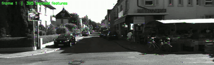
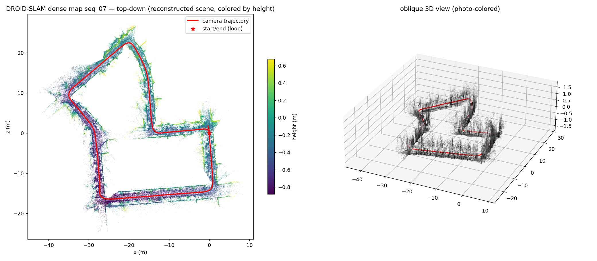
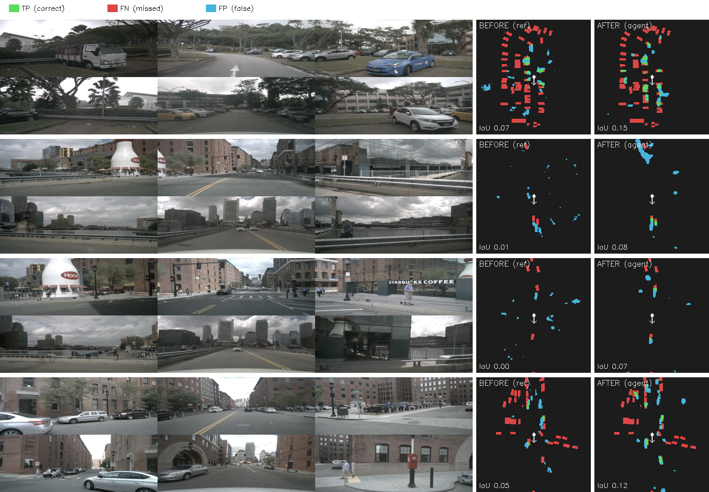
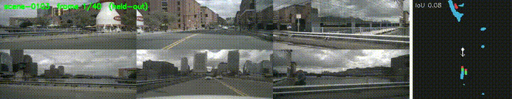
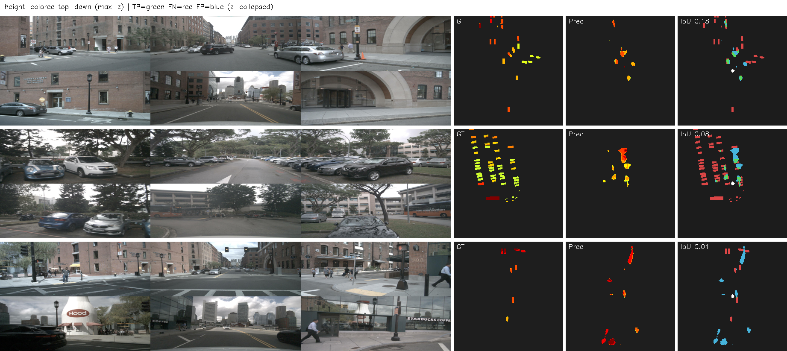
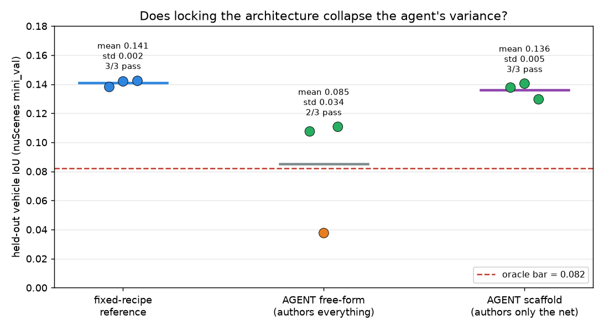
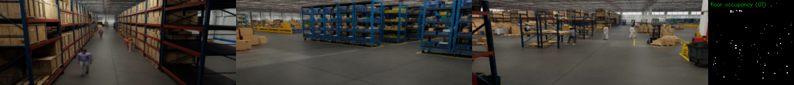

# LenaLab — Project Report

*What this project is, what we built, and what it proves · 2026-06-21*

---

## 1. One-paragraph summary

**LenaLab is a verification-first research lab in which an AI agent does real computer-vision
research** — it analyzes a problem, researches an approach, writes the algorithm, trains it on a GPU
when needed, and then a **deterministic, LLM-free grader** measures it on **held-out data the agent
never saw**. Over ~3 weeks (2026-06-02 → 2026-06-21, 30 commits) the same loop was driven through
**seven distinct problem classes** — six in autonomous driving (visual odometry, SLAM, KITTI stereo,
learned VO, multi-camera BEV, 3D occupancy) and a seventh off the road (static multi-camera warehouse
floor occupancy). Every headline number is measured on unseen data; one early over-claim was retracted;
negative results and infrastructure failures are kept on the record. The point isn't any single model —
it's a **method**: an agent that researches, plus a grader that keeps it honest.

## 2. The core idea

Most "AI writes code" demos stop at *"it ran."* LenaLab's thesis is that **"it ran" is never success —
only "it generalized" counts.** So the architecture cleanly separates two roles:

- **The solver (the AI agent)** — analyzes the data, researches a method, authors the algorithm, trains
  it. This is where the intelligence and creativity live.
- **The verifier (the harness)** — owns the ground truth, the metric, and the threshold. It grades the
  solver's output on a held-out split the solver was never given, in a sandbox. It is deterministic and
  contains no LLM, so it cannot be sweet-talked.

This split is what makes the results trustworthy: the agent is graded by something it can't influence,
on data it can't see. The verification spine is imported from **Touchstone**; the lab (`vo_lab/`) adds
the domains, the agent tasks, and the graders.

## 3. What we built — the seven domains

Each domain is a full contract: a data adapter (raw data → on-disk tensors + held-out GT), a
from-scratch reference (sets a calibration bar), a harness-owned grader (anti-tamper), and the live
agent-authoring run.

| # | Domain | What the agent authored | Held-out result | Status |
|---|---|---|---|---|
| 1 | **RGB-D VO** | SIFT→PnP RANSAC + KLT, metric depth | **ATE 0.033 m** (unseen scene) — beats classical 0.057 | ✅ VERIFIED |
| 2 | **Monocular VO** | optical-flow + wide-baseline keyframes | ATE 0.052 m (Sim3, unseen) | ✅ VERIFIED |
| 3 | **KITTI stereo VO** | SGBM depth → ORB → PnP, outdoor driving | t_err 2.08% (unseen seq) | ✅ VERIFIED |
| 4 | **Learned VO** (GPU) | ResNet pose-CNN + optical-flow input, from scratch | 19.8 m (n=3) — beats learned ref ~1.7× | ✅ VERIFIED |
| 5 | **BEV perception** | Lift-Splat, 6 cams → top-down vehicle occupancy | scaffold **0.136 ± 0.005 IoU, 3/3** | ✅ VERIFIED + variance-fixed |
| 6 | **3D occupancy** | Lift-Splat-to-3D, 6 cams → 200×200×12 voxels | scaffold **0.079 ± 0.004 IoU, 3/3** | ✅ VERIFIED + variance-fixed |
| 7 | **Smart-space floor occ** *(off-road)* | IPM + temporal bg-sub, 19 static cams → floor map | **0.39–0.44 IoU, 2/2** — **~2× the reference** | ✅ VERIFIED |

Plus a real **SLAM benchmark** (stereo DROID, 0.03–0.20 % on km-scale KITTI loops) and a **Track-A
autonomous committee** (a multi-expert agent program that improved held-out ATE 26 % over a lineage of
experiments — proving the lab is a self-directing research *program*, not just single-shot authoring).

### Methods & resources (hardware · data · training · result)

| Domain | Hardware | Dataset (size · train/val) | Training | Held-out result |
|---|---|---|---|---|
| RGB-D VO | CPU (sandbox) | TUM RGB-D fr1 · 3.1 GB · unseen `fr1_desk` | none (classical geometry) | ATE **0.033 m** |
| Monocular VO | CPU | TUM RGB-D fr1 · 3.1 GB | none (classical) | ATE 0.052 m |
| KITTI stereo VO | CPU | KITTI odom stereo · 32 GB · seq00 dev, 05/07 held-out | none (classical) | t_err **2.08 %** |
| Learned VO | GPU (RTX 3080 16 GB) | KITTI multi-seq | from scratch, n=3 | 19.8 m (beats learned ref) |
| BEV perception | GPU (3080 / RTX 4090) | nuScenes **mini** · 4 GB raw → 227 MB cache · 323/81 | from scratch, ~24 ep | scaffold **0.136 ± 0.005 IoU** |
| 3D occupancy | GPU | nuScenes **mini** · 226 MB cache · 323/81 | from scratch, ~24 ep, 0.57 GB VRAM | scaffold **0.079 ± 0.004 IoU** |
| Smart-space floor occ | **cloud RTX 4090 24 GB** (RunPod) | NVIDIA Smart Spaces 1 warehouse · 19 cams, 2.9 GB video → 481 MB cache · 210/90 | from scratch IPM; agent run ≈ **14 min** GPU (~120 ep) | **0.39–0.44 IoU** (~2× ref) |
| SLAM benchmark | GPU | KITTI loops · 32 GB | pretrained DROID (no training) | **0.03–0.20 %** on km-scale loops |

*Notes: classical-CV domains (VO/SLAM front-ends) train **nothing** — they're geometry, run on CPU. The
learned domains train **from scratch** (no pretrained weights in the sandbox), so absolute numbers are
modest by design. Cloud cost for the smart-space run was **~$2–3** (RTX 4090 @ $0.69/hr; agent session
io-wall ≈ 829 s, ≈ 2.4 M tokens). Datasets are deliberately small (nuScenes **mini** = 10 scenes; one
warehouse scene) — the claim is generalization-of-method, not scale.*

### Pictures (held-out, every one)

*▶️ The agent's VO tracking features (flow trails) across a KITTI street — the motion front-end
(animated; HD video: `artifacts/slam_benchmark/tracking_seq07.mp4`).*

*Stereo DROID-SLAM reconstructing a km-scale KITTI loop (top-down height-colored + 3D); the trajectory
(red) closes the loop. Build animation: `artifacts/slam_benchmark/loop_build_seq07.gif`.*

*BEV vehicle occupancy: 6 surround cams (left) → **BEFORE** (reference) vs **AFTER** (agent) vs held-out
GT. Green=correct, red=missed, blue=false. The agent ~doubles IoU on unseen scenes.*

*▶️ The agent's BEV occupancy swept across a full held-out scene (the agent's detection result vs GT,
frame by frame).*

*3D occupancy: cameras → held-out voxel GT vs the agent's prediction (height-colored + TP/FN/FP).*

> 🖼️ **Full picture tour across all seven domains (with animations): [`GALLERY.md`](../GALLERY.md).**

## 4. The headline scientific finding (replicated in 2D and 3D)

When an agent authors a perception network **freely**, its results are **high-variance** — it can write
an excellent network *or* self-sabotage the fragile geometry/augmentation (BEV & occupancy free-form:
~2/3 pass, σ ≈ 0.02–0.03). When the fragile parts are **locked in a scaffold** and the agent authors
*only the network*, the variance **collapses ~6–7× to near-reference reliability (3/3 pass)**.

So: **an agent's authoring freedom is its variance source, and scaffolding scopes it.** This was found in
2D (BEV), then deliberately re-tested and **replicated in 3D (occupancy)** at a clean n=3 — the lab
working as a method: build → find it's non-robust → diagnose → fix → validate → **replicate**.

*Free-form agent runs scatter (high variance); locking the geometry in a scaffold collapses it to
near-reference reliability, 3/3 passing. The same effect replicates in 3D
(`artifacts/occ/occ_scaffold_compare.png`).*

## 5. What the agent actually figured out (not hyperparameters)

The captured agent code shows genuine design reasoning, e.g.:
- chose **depth for metric scale** (RGB-D), **descriptor matching for fast motion** (KITTI);
- after a 412 m SLAM divergence, switched to a **stable linear pose graph** that "can't diverge";
- gave a learned VO **optical flow as input**; used **FP32 + class weighting + a 2-stage curriculum** for
  sparse 3D occupancy;
- on the 7th domain, **noticed the cameras are static** and invented **temporal background subtraction**
  + **adaptive top-K inference** — which is why it beat the geometric baseline.

Full catalogue: [`claudedocs/what_the_agent_figured_out.md`](what_the_agent_figured_out.md).

## 6. The 7th domain in focus — off the road

The most recent work (and a good illustration of the whole loop):
1. **Strategy.** A vertical-expert exercise asked "where in real life would a cheap top-down 'what's
   where' map matter?" → converged on **static multi-camera spaces** (warehouses, retail, eldercare),
   with two insights: *"a map, not a camera"* (privacy by construction) and *"trust on day one"* (every
   space is unique → self-verification is the unlock).
2. **Design + de-risk.** Picked NVIDIA Physical AI Smart Spaces; verified on one warehouse that
   calibration projects the GT correctly (7/8 inside the dataset's own 2D boxes).
3. **A real finding.** The driving **Lift-Splat failed** on static overhead cameras (~3 % frustum
   coverage, no spatial learning); the fix was **IPM** through the verified camera matrix (coverage
   3 % → 98.8 %). *Transfer the method, not the geometry.*
4. **Result.** From-scratch IPM reference ~0.22; the **free-form agent hit 0.44 and 0.39 (2/2 VERIFIED),
   ~2× the reference**, graded on unseen-time frames — by inventing static-camera-specific techniques.

*▶️ Warehouse demo: a fixed camera with agent detections (green) → the live top-down floor-occupancy map
(agents as bright dots), swept across the held-out window — the domain's job in motion.*

*"A map, not a camera": three of the 19 fixed warehouse cameras → a top-down floor-occupancy map (right,
dots = people/forklifts/robots) — the privacy-preserving output the agent learned and verified.*

Report: [`claudedocs/smartspace_domain_report_2026-06-21.md`](smartspace_domain_report_2026-06-21.md).

## 7. Infrastructure built along the way

- **Cloud execution.** A `LAB_JOB_MODE=local` switch lets the lab run on a rented GPU (RunPod) without
  nested Docker; validated end-to-end on an RTX 4090. Runbook + bring-up scripts in `scripts/cloud/`.
- **A pod supervisor** (`scripts/cloud/pod_supervisor.sh`) — writes a live status file, is GPU-aware,
  **salvages artifacts on completion**, and auto-terminates pods on done/error/stale/max-wall (closes
  the cost + silent-hang gaps that plain completion-notifications miss).
- **Anti-tamper grading** — 11 test files, incl. red-team tests proving a malicious eval that claims a
  perfect score is overridden by the harness-owned grader. All **25 tests pass**.

## 8. The discipline (why the numbers are trustworthy)

- **Held-out everything.** Every headline number is on data the agent never trained on.
- **A retraction on the record.** An early "VERIFIED 0.1075" BEV claim was a single lucky run; re-run at
  n=3 it was 0.085 ± 0.034 (2/3) — corrected, not buried.
- **Honest negatives kept.** A 412 m SLAM divergence, a self-sabotaging BEV run, a from-scratch
  loop-closure failure, a C++ IMU-fusion dead-end.
- **Failures surfaced.** A 3-hour training hang (no job-level timeout) → fixed with `timeout` wrapping +
  a watchdog. A lost agent model (pod auto-terminated before salvage) → fixed by making the supervisor
  artifact-safe. Both written up, not hidden.

## 9. Honest scope (what this is *not*)

- Datasets are small (nuScenes **mini**, one warehouse scene, TUM/KITTI sequences) and models train
  **from scratch** (no pretrained weights in the sandbox) → **absolute numbers are below full-scale
  literature.** The claim is **"the agent's research loop works and generalizes,"** not SOTA.
- The 7th domain is **per-space self-verification** (unseen *time*), not cross-space generalization
  (unseen *warehouse*) — the bolder stretch is deferred.
- The variance study (n=3 + scaffold) was done for BEV and occupancy, **not** repeated for smart-space.

## 10. Where it stands

- **Seven agent-authored domains VERIFIED** on held-out data; the verification spine + both tracks
  (autonomous committee, code-authoring implementer) built and proven; cloud-runnable.
- **Public repo:** `github.com/WhaSukGO/LenaLab` (privacy-swept throughout).
- **Open frontiers:** a full-scale headline number (rent an A100, full data); cross-space generalization
  for smart-space; n=3/scaffold for the 7th domain; fully-autonomous cloud provisioning (currently needs
  a console-deployed pod — API/MCP pods don't expose SSH in this account).

**Bottom line:** LenaLab demonstrates an AI agent doing end-to-end CV research — analyze, build, train,
and *prove it generalizes* — across seven problem classes, with a method (and a record) honest enough to
catch its own mistakes.

---
*Per-domain evidence: [`RESULTS.md`](../RESULTS.md) · overview: [`README.md`](../README.md) · agent
design decisions: [`what_the_agent_figured_out.md`](what_the_agent_figured_out.md) · the chronicle:
[`blog_agent_in_a_lab_2026-06-03.md`](blog_agent_in_a_lab_2026-06-03.md).*
