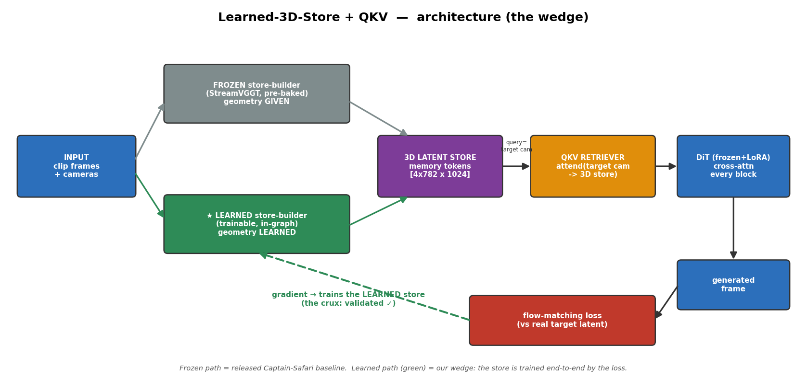
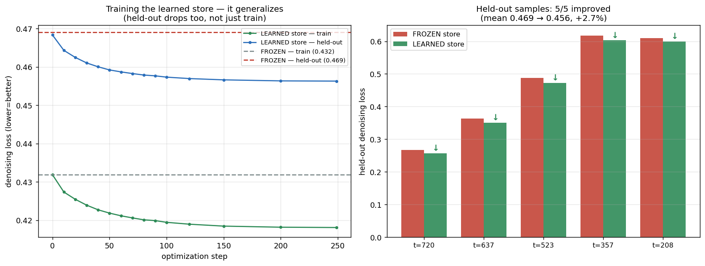
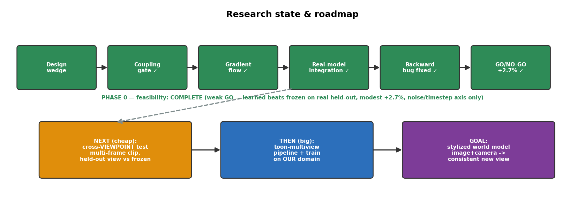

# Research State Report — Learned-3D-Store + QKV ("the wedge")

*2026-06-26 · visual summary of where the project stands: the idea, the architecture, the result, next steps.*

---

## 1. What we're building (in one picture)

**Goal:** an image generator that can take *one image + a target camera* and produce the *same scene from a
new angle, consistently* — by keeping an internal **3D memory** it can *query*. The open research bet: make
that 3D memory **learned from the generation loss** (not handed in by an off-the-shelf depth model) and
**queried by attention**. That exact combination was *empty* in the literature — it's the contribution.

We test it as a **minimal fork of Captain Safari** (an open video model that already has a QKV-queried 3D
memory): swap its *frozen, pre-baked* memory for a *trainable, in-graph* one and see if it helps.

**How to read it:** the **grey** path is the released baseline — geometry is *handed in* (StreamVGGT,
pre-baked). The **green** path is our wedge — a **trainable store** that the generation loss shapes
end-to-end (the dashed green arrow is the gradient reaching it). Everything else (the QKV retriever, the DiT)
is reused. The whole experiment is: *does the green store beat the grey one?*

---

## 2. The result so far (the go/no-go)

We got the real model running on real data (VAE/T5-encoded clip) and ran a **held-out** test: train the
store on some noise/timestep samples, then measure loss on **disjoint samples it never saw**, vs the frozen
store.

- **Left:** the learned store's loss drops on **both** train *and* held-out — so it **generalizes** (it
  isn't just memorizing). It crosses below the frozen baselines (dashed lines).
- **Right:** on the 5 held-out samples, **5/5 improved**; mean **0.469 → 0.456 (+2.7%)**.

**Verdict: a real but *weak* GO.** The learned store genuinely beats the frozen one on real, held-out data —
consistent and generalizing — **but the margin is modest (~2.7%)**, and the held-out axis is **noise/timestep
only** (the demo clip has a single camera/query frame, so the headline claim — helping across *viewpoints* —
is **not yet tested**).

**Honesty notes (what this is NOT):** not a large win; not on our target (stylized) domain; not yet a
cross-*viewpoint* result. It validates the *mechanism on real data*, not (yet) the full thesis.

---

## 3. How we got here, and what's next

**Phase 0 (feasibility) — COMPLETE.** Design → confirmed the architecture is swappable (coupling gate) →
proved gradients reach a trainable store (gradient-flow) → ran the real 5B model on real data → found & fixed
a backward-pass bug (by decoupling encoding from training) → got the go/no-go number (+2.7%, weak go).

**Next step (cheap, recommended): the cross-*viewpoint* test.** The +2.7% is on noise/timestep, not new
camera angles — which is the thing we actually care about. Use a clip with **multiple query frames**: train
the store on some viewpoints, test on a **held-out viewpoint** vs frozen. *If learned beats frozen across
viewpoints → strong go.* If not → we learned cheaply that the gain doesn't extend to viewpoints, before any
big build.

**Then (big): the toon-multiview pipeline.** Only if the viewpoint test passes — build our own
stylized-but-geometric data (rendered toon-3D from many known cameras) and train the wedge on **our domain**.

**Goal: a stylized "world model"** — feed it a drawing + a camera, get a consistent new view, and accumulate
an explorable world.

---

## 4. Practical state
- **Everything reproducible:** scripts, results, env-lock, and these figures in `artifacts/learned3d_wedge/`.
- **Pod stopped** (resumable; `/workspace` has the 10 GB weights + encoded inputs staged).
- **Cost lessons baked in:** download from HuggingFace not ModelScope (40× faster); the resume wipes the pip
  env (only `/workspace` persists) → restore from the saved lock; decouple encode from train to keep the
  autograd graph clean.

**One-line status:** *the mechanism works and shows a real (if modest) generalizing signal on real data —
enough to justify the cheap cross-viewpoint test, which is the true go/no-go for the whole direction.*
