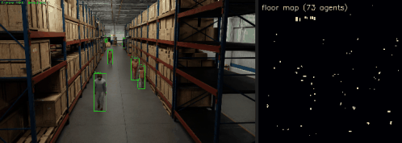

# A Seventh Domain, Off the Road: a Self-Verifying Top-Down Map of a Space

*Project report · 2026-06-21 · LenaLab*

---

## 1. Why this exists

The first six domains were all **autonomous driving** (VO, SLAM, BEV, 3D occupancy — a moving ego
vehicle). This one leaves the road. The question: does the lab's analyze→research→implement→train→verify
loop carry to a **different problem class** — *static* multi-camera perception of a fixed space — and is
the agent's edge real where the data is fresh rather than a saturated leaderboard?

The framing came from a vertical-expert exercise ("where, in real life, would a cheap top-down 'what's
where' map matter?"). Two insights recurred across warehouses, retail, eldercare, venues: **"a map, not
a camera"** (occupancy is privacy-preserving by construction) and **"trust on day one"** (every space is
unique, so a model that *self-verifies* on a brand-new space is the unlock). This domain makes the second
literal: the held-out gate **is** the per-space "trust on day one" claim.


*▶️ The domain in motion: a fixed warehouse camera with agent detections (green boxes) → the live
top-down floor-occupancy map (agents as bright dots), across the held-out (unseen-time) window.*

## 2. The task

**NVIDIA Physical AI Smart Spaces** (AI City `MTMC_Tracking_2026`, `Warehouse_000`): 19 fixed overhead
cameras (1080p video), shared world frame, 3D box annotations for agents (people, forklifts, robots).
The agent predicts a **top-down floor-occupancy grid** (206×203 @ 0.5 m world cells), scored by
**floor IoU**. Occupied cells are **sparse (~0.5 %)**, so absolute IoU is lower than a dense task — expected.

**Held-out split = per-space self-verification:** train on the scene's **first 70 % of the timeline**,
grade on the **last 30 % (unseen time, same space)**. This is exactly the deployable claim: *stand up and
verify a model for THIS space from a short window.* (Cross-space generalization — a brand-new warehouse —
is the harder stretch, deferred.)

## 3. The ground truth the agent learns against

`scripts/prep_smartspace.py` samples frames (1/s), and for each annotated agent rasterizes its oriented
**XY footprint** into the world floor grid. Held-out GT is the secret `<token>_bev.npy`. 210 train / 90
val. *Honest caveat:* this is **box-derived agent occupancy** (people/forklifts/robots), not a dense
semantic map — a self-contained, deliberate simplification. The grader is harness-owned, so the IoU the
agent earns is one it generalized to unseen-time frames.

## 4. A real geometry finding: the driving model is wrong here

First instinct was to reuse the BEV/occupancy **Lift-Splat** (learned per-pixel depth → lift to a frustum
of 3D points → pool into the grid). On these **static overhead** cameras it **failed**: the learned-depth
frustum scattered thinly across a 100×100 m warehouse — only **~3 % of lifted points landed in-grid**, and
the model learned the occupancy *rate* but not *where* (val IoU ≈ 0). Lift-Splat is built for
forward-facing cameras at moderate range on a moving car; this is a different geometry.

The fix is the geometry the setting *wants*: **Inverse Perspective Mapping (IPM)**. Because cameras are
static and we predict a ground plane, project each floor cell (at a few height planes) straight through
the dataset's verified `cameraMatrix` and sample the camera features there. Coverage went **3 % → 98.8 %**
(100 % of occupied cells). *(A second bug surfaced here too: a decomposed `cam2world` extrinsic didn't
round-trip the projective `cameraMatrix` — so IPM projects through `cameraMatrix` directly, no
decomposition.)* This is the domain's honest engineering lesson: **transfer the method, not the geometry.**

**From-scratch IPM reference, 3 seeds: 0.216 / 0.232 / ~0.22 → ~0.22** — a stable, learned baseline
(the static-camera floor mapping genuinely works), sets the calibration bar (ref/1.3 ≈ 0.166).

## 5. The agent designs, trains, and self-verifies its own net — and beats the reference

A sandboxed agent (Claude, in `local` mode on a cloud GPU) authored a floor-occupancy network from
scratch, trained it, and was graded on the held-out unseen-time frames:

| run | held-out floor IoU | verdict |
|---|---|---|
| 1 | 0.4378 | ✅ VERIFIED |
| 2 | 0.3942 | ✅ VERIFIED |
| reference (IPM, 3 seeds) | ~0.22 | — |

**Both runs clear the bar (0.166), and both ≈ 1.8–2× the hand-written IPM reference.** On a brand-new,
non-driving domain, the agent's authored model *beat the baseline I wrote* — graded on data it never saw.

### What the agent figured out (its own `main.py`, salvaged)

The agent didn't just re-derive IPM — it added domain-appropriate ideas the reference lacks
(`artifacts/smartspace/agent_smartspace_model.py`):
- **Temporal background subtraction** — exploiting that the cameras are *static*: a median background
  image, differenced per frame, makes moving agents pop. Input is **6-channel** (3 RGB + 3 bg-diff).
- **Multi-plane IPM** at 4 heights, fused **mean + max** across the 19 cameras.
- **Focal loss** (α=0.97, γ=2) matched to the ~0.4 % positive rate.
- **Adaptive top-K inference** — predict the per-frame *expected* number of occupied cells (rank-based),
  so it's robust to probability-scale drift on unseen frames rather than using a fixed threshold.

That is the agent reasoning as a researcher: it noticed the cameras are static and **built a method
around that fact** — which is precisely why it beat a generic geometric baseline.

## 6. Honest scope

- **One scene** (`Warehouse_000`), box-derived occupancy, from-scratch backbones → absolute IoU is for
  *this* space, **per-space self-verification** (unseen time, not unseen space). Cross-space generalization
  is the deferred stretch and would report lower, honestly.
- **No n=3 / no scaffold yet** here (the prior domains' variance study is not repeated): two free-form
  runs, both VERIFIED. The claim is **the loop transfers to a new problem class and the agent beats the
  baseline on fresh data** — not a variance result or a SOTA number.
- The first free-form run's `main.py` was **lost** (pod auto-terminated before salvage); the supervisor
  was then fixed to salvage artifacts before terminating, and run 2's model is captured. Recorded, not hidden.

## 7. Files

```
scripts/prep_smartspace.py                  videos+calib+3D-box GT → world floor-occupancy npz (per-space split)
scripts/smartspace_ref.py                   IPM reference + variance trainer
scripts/derisk_smartspace.py                Phase-0 calib/projection/GT de-risk
scripts/viz_smartspace.py                   'map, not a camera' figure (cams + top-down GT)
vo_lab/plugins/smartspace.py                Track-B provider
vo_lab/plugins/vo_ref/eval_smartspace.py    independent floor-IoU grader
vo_lab/plugins/vo_ref/run_smartspace_learned.py  from-scratch IPM reference main.py
vo_lab/agents/smartspace_implementer.py     free-form task spec + authors
vo_lab/run_smartspace_{calibration,implement}.py
scripts/cloud/pod_supervisor.sh             live-status + GPU-aware staleness + artifact-salvage guard
artifacts/smartspace/                       agent model, run log, result, map figure
```

**Verdict:** the lab's analyze→research→implement→train→verify loop **carries off the road**. On static
multi-camera warehouse perception — a fresh, non-driving domain — the from-scratch IPM reference is stable
(~0.22), and a free-form agent **authored a model that beat it (~0.39–0.44, both VERIFIED)** by inventing
static-camera-specific techniques, graded on unseen-time frames. **Seven domains now**, and the first that
isn't autonomous driving — a self-verifying top-down map of a real space.
